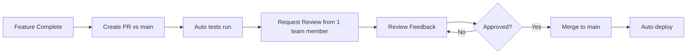

# Git Development Workflow Guide

**Small Development Request (SDR) Management System**
**Team Size:** 3-5 Developers

**Document Version:** 1.0
**Date:** January 2025
**Author:** Development Lead

---

## 1. Executive Summary

This guide establishes a streamlined Git development workflow optimized for our small team of 3-5 developers working on the SDR Management System. The workflow prioritizes:

- **Simplicity** over complexity (no GitFlow for a small team)
- **Fast feedback cycles** aligned with 2-week sprint cadence
- **Direct collaboration** minimizing bureaucratic overhead
- **Quality assurance** through lightweight peer reviews
- **Clear communication** in a small team environment

**Key Technologies Used:**
- **Source Control:** Git with GitHub hosting
- **Issue Tracking:** Azure DevOps (work items, boards, documentation)
- **CI/CD:** GitHub Actions (to be implemented)
- **Project Management:** Azure DevOps (agile planning)

---

## 2. Branching Strategy

### 2.1 Overview
Our simplified branching strategy replaces complex workflows with a pragmatic approach suitable for small teams:

```
main (production)
├── feature/branch-from-main
├── bugfix/urgent-hotfix
└── develop (optional shared dev environment)
```

### 2.2 Main Branches

#### `main` Branch (Production)
- **Purpose:** Represents production-ready code
- **Protection:** Branch protection rules enabled
- **Merging:** Only through approved Pull Requests
- **Deployment:** Automatic deployment to production

#### `develop` Branch (Optional Shared Environment)
- **Purpose:** Latest integrated changes for quality assurance
- **Use:** When team wants a shared development environment
- **Merge:** Regular merges from approved features

### 2.3 Feature Branches

#### Naming Convention
```
feature/add-user-authentication
feature/fix-email-processing
bugfix/navbar-styling
hotfix/critical-security-patch
```

#### Guidelines
- **Branch from `main`** (or `develop` if used)
- **One feature per branch** - keep branches focused
- **Short-lived branches** - aim for 1-3 day completion
- **Regular syncing** - rebase with `main` daily
- **Push regularly** for visibility

### 2.4 Workflow Commands

```bash
# Starting new work
git checkout main
git pull origin main
git checkout -b feature/add-user-validation

# Daily sync (important!)
git fetch origin
git rebase origin/main

# Clean up after merge
git branch -d feature/add-user-validation
git push origin --delete feature/add-user-validation
```

---

## 3. Pull Request Process

### 3.1 When to Create a PR

- **Feature complete:** Core functionality working
- **Unit tests added:** For new/modified code
- **Documentation updated:** Code comments, manuals
- **Peer reviewed:** Code walkthrough completed
- **Ready for QA:** No critical bugs remaining

### 3.2 PR Template Structure

**Title Format:**
```
[Feature/Bugfix/Hotfix] Brief description (ref: SDR-123)
```

**PR Description Template:**
```markdown
## Description
Brief overview of changes and why they're needed.

## Changes Made
- [ ] Feature implementation
- [ ] Unit tests added
- [ ] Documentation updated
- [ ] Breaking changes noted

## Testing
- [ ] Manual testing completed
- [ ] Unit tests pass
- [ ] Integration tests pass
- [ ] No new lint errors

## Related Azure DevOps Items
- SDR-123: Add user authentication
- Blocks deployment to staging

## Checklist
- [ ] Code follows team standards
- [ ] PR is review-ready
- [ ] Merge conflicts resolved
```

### 3.3 PR Workflow



### 3.4 PR Best Practices

- **Keep PRs small:** 200-400 lines max
- **Clear descriptions:** Explain the problem and solution
- **Reference issues:** Link to Azure DevOps work items
- **Use draft PRs:** When work-in-progress
- **Update regularly:** Address feedback promptly

---

## 4. Code Review Procedures

### 4.1 Review Guidelines for Small Teams

#### Core Objectives
- **Catch bugs early** before they reach main
- **Share knowledge** across the team
- **Maintain code quality** standards
- **Foster collaboration** in small team culture

#### Review Principles
- **Friendly and constructive** - assume good intent
- **Focus on code quality** - not personal style preferences
- **Technical debt discussion** - note "future improvement" items
- **Learning opportunity** - explain rationale for changes

### 4.2 Review Process

#### Step 1: Request Review
```markdown
@DevTeam Hey team! Ready for review on the new SDR creation feature.

Key changes:
- Added form validation for required fields
- Integrated with Azure DevOps API
- Added error handling

Could someone review when you have 30 minutes?
```

#### Step 2: Reviewer Assessment
**Quick Response (within 4 hours):**
- Code looks good → ✅ Approve
- Small fixes needed → 💬 Comments
- Major issues → ❌ Request changes

#### Step 3: Discussion & Resolution
- **Inline comments** for specific issues
- **General discussion** for architectural concerns
- **Resolve threads** after fixes applied
- **Update PR** with improvements

### 4.3 Code Review Checklist

#### Functionality
- [ ] Code works as intended
- [ ] No obvious bugs or edge cases missed
- [ ] Error handling implemented
- [ ] Tests written and passing

#### Code Quality
- [ ] Clear variable/function names
- [ ] Consistent formatting and style
- [ ] No duplicate code
- [ ] Documentation updated (code comments)

#### Security & Performance
- [ ] No security vulnerabilities
- [ ] Efficient algorithms used
- [ ] No performance regressions

### 4.4 Roles & Responsibilities

#### Author Responsibilities
- Test thoroughly before requesting review
- Address all reviewer feedback promptly
- Explain complex changes clearly
- Keep PR focused and minimal

#### Reviewer Responsibilities
- Review within 4 working hours
- Provide clear actionable feedback
- Explain reasoning for significant changes
- Approve or request changes explicitly

### 4.5 Handling Conflicts

**In Small Teams:**
1. **Communicate directly** - don't let issues fester
2. **Escalate to Lead** if deadlock occurs
3. **Use technical merit** to resolve disagreements
4. **Document decisions** for future reference

---

## 5. Merge Procedures

### 5.1 Merge Requirements

#### Pre-Merge Checklist
- [ ] ✅ PR approved by at least 1 team member
- [ ] ✅ All CI/CD checks passing
- [ ] ✅ Conflicts resolved
- [ ] ✔️ Code review feedback addressed
- [ ] 📝 Documentation updated

#### Automated Quality Gates (Future Implementation)
- [ ] ESLint no errors
- [ ] Jest tests passing (unit + integration)
- [ ] Code coverage > 80%
- [ ] Security scan clean
- [ ] Build successful

### 5.2 Merge Strategies

#### Squash Merge (Default)
```bash
# Recommended for feature branches
git merge --squash feature/add-validation
```
**When to use:** Most features and bug fixes
**Benefits:** Clean history, logical commit sizes
**Result:** All changes in single commit

#### Rebase Merge
```bash
git rebase origin/main
git merge --ff-only feature/add-validation
```
**When to use:** Hotfixes, small changes
**Benefits:** Linear history
**Result:** Maintains branch commit structure

### 5.3 Conflict Resolution

#### Small Team Approach
1. **Sync early:** Pull main daily minimizes conflicts
2. **Communicate:** Warn team about big changes
3. **Resolve systematically:** Test after each resolve
4. **Clean up:** Don't commit merge conflicts by accident

#### Resolution Process
```bash
# Step 1: Update your branch
git fetch origin
git rebase origin/main

# Step 2: Fix conflicts in editor
# Step 3: Test the merge
npm test
npm run build

# Step 4: Continue rebase
git rebase --continue
```

### 5.4 Post-Merge Actions

- **Delete feature branch** immediately after merge
- **Update local branches:** `git pull --all --prune`
- **Close related issues** in Azure DevOps
- **Communicate completion** to team

---

## 6. Best Practices

### 6.1 Commit Message Guidelines

#### Format
```
type(scope): brief description

Body: optional detailed explanation

Footer: related issue (SDT-123, fixes #456)
```

#### Types
- `feat:` New features
- `fix:` Bug fixes
- `docs:` Documentation changes
- `style:` Code style changes
- `refactor:` Code refactoring
- `test:` Adding/fixing tests
- `chore:` Maintenance tasks

#### Examples
```
feat(auth): add OAuth2 support for Teams integration

User can now authenticate using Microsoft Teams credentials
instead of separate login.

Fixes SDR-456: Teams Authentication Flow
```

### 6.2 Coding Standards

#### TypeScript/React Guidelines
- **Var naming:** camelCase for variables, PascalCase for components
- **Files:** ComponentName.tsx, utils.ts for utilities
- **Imports:** Group by external libs, then internal modules
- **Error handling:** Use try/catch for async operations
- **Types:** Define interfaces for component props and API responses

#### Testing Requirements
- **Unit tests** for all business logic functions
- **Component tests** for React components with user interactions
- **Integration tests** for API calls and data flow
- **Manual testing** for user-facing features

### 6.3 Documentation Standards

#### Code Documentation
- **Functions:** JSDoc comments for public APIs
- **Components:** Props interface documentation
- **Complex logic:** Inline comments explaining why

#### Project Documentation
- **README updates** for new features or setup changes
- **API documentation** for backend endpoints
- **Release notes** for production deployments

### 6.4 Release Management

#### Sprint Release Process
1. **Sprint planning:** Features planned for delivery
2. **Daily sync:** Track progress and blockers
3. **Code freeze:** Last 2 days for stabilization
4. **Testing:** System integration testing
5. **Release:** Merge main to production

#### Hotfix Process
1. **Immediate assessment:** Is it production-blocking?
2. **Create hotfix branch** directly from main
3. **Implement minimal fix** with high test coverage
4. **Get immediate review** from available team member
5. **Deploy and validate** within same sprint

---

## 7. Communication & Escalation

### 7.1 Daily Communication

#### Stand-up Format
**15-30 minute meetings:**
- What did you work on yesterday?
- What will you work on today?
- Any blockers or need help?

**Focus on:**
- Collaboration opportunities
- Progress updates
- Quick technical discussions

### 7.2 Escalation Procedures

#### When to Escalate
- **Technical issues** impacting multiple developers
- **Design decisions** affecting architecture
- **Timeline concerns** threatening sprint goals
- **Resource needs** beyond team capabilities

#### Simple Escalation Path
1. **Peer discussion:** Talk to relevant team member
2. **Team discussion:** Bring up in stand-up if needed
3. **Lead involvement:** If can't resolve quickly
4. **External stakeholders:** Only when team consensus reached

### 7.3 Decision Making

#### Technical Decisions
- **Small:** Discuss with 1 peer, implement
- **Medium:** Quick team discussion, document
- **Large:** Present options, team vote

#### Timeline Estimates
- **Accurate:** Use historical data from Azure DevOps
- **Conservative:** Add 20% buffer for unknowns
- **Communicate:** Update estimates as work progresses

---

## 8. CI/CD Integration (Future Implementation)

### 8.1 GitHub Actions Workflows

#### Pull Request Pipeline
```yaml
# .github/workflows/pr-checks.yml
name: PR Quality Gates
on: pull_request

jobs:
  quality-checks:
    runs-on: ubuntu-latest
    steps:
      - uses: actions/checkout@v3
      - uses: actions/setup-node@v3
        with:
          node-version: '18'
      - run: npm ci
      - run: npm run lint
      - run: npm test
      - run: npm run build
```

#### Deployment Pipeline
```yaml
# .github/workflows/deploy.yml
name: Deploy to Production
on:
  push:
    branches: [ main ]

jobs:
  deploy:
    runs-on: ubuntu-latest
    steps:
      - uses: actions/checkout@v3
      - uses: azure/login@v1
      - run: az webapp deploy --resource-group rg-sdr-prod --name sdr-app
```

### 8.2 Branch Protection Rules

#### Main Branch Protection
```json
{
  "required_status_checks": {
    "strict": false,
    "contexts": ["tests", "build", "security-scan"]
  },
  "enforce_admins": false,
  "required_pull_request_reviews": {
    "required_approving_review_count": 1,
    "dismiss_stale_reviews": true
  },
  "restrictions": null
}
```

---

## 9. Troubleshooting

### 9.1 Common Issues

#### Merge Conflicts
**Problem:** Multiple people editing same files
**Solution:** Communicate file ownership, rebase frequently

#### PR Stale Reviews
**Problem:** Reviews get outdated
**Solution:** Update PR promptly, mention reviewers

#### Branch Management
**Problem:** Too many stale branches
**Solution:** Delete branches after merge, weekly cleanup

### 9.2 Getting Help

- **Team Slack channel:** #sdr-dev for quick questions
- **Azure DevOps:** Reference existing work items
- **GitHub:** Issues for workflow process questions
- **Monthly review:** Team retrospective for workflow improvements

---

## 10. Quick Reference

### 10.1 One-Page Workflow

1. **Start:** `git checkout -b feature/xyz`
2. **Develop:** Test regularly, commit small changes
3. **Sync:** `git pull --rebase origin main` daily
4. **Review:** Push and request PR review
5. **Fix:** Address review feedback promptly
6. **Merge:** Squad approve → merge to main
7. **Clean:** Delete merged branch

### 10.2 Emergency Emergency Process

**For critical production issues:**
1. Alert team immediately
2. Create hotfix branch from main
3. Implement minimal fix
4. Get immediate review (can be single reviewer)
5. Merge and deploy
6. Retrospective to learn from incident

---

## 11. Process Improvement

### 11.1 Metrics to Track

- **PR review time:** Goal < 4 hours
- **Time-to-merge:** Goal < 24 hours
- **Branch age:** Goal < 3 days
- **Test coverage:** Goal > 80%
- **Deployment frequency:** Goal 2-3x per week

### 11.2 Monthly Review

- **What's working:** Keep successful practices
- **What's challenging:** Identify pain points
- **Team feedback:** Survey for improvement ideas
- **Process updates:** Adapt workflow as team grows

**Next review date:** [Insert date]

---

This workflow is optimized for our small development team while maintaining professional standards and scalability. As the team grows beyond 5 members, consider evolving to more structured processes like trunk-based development or GitFlow.