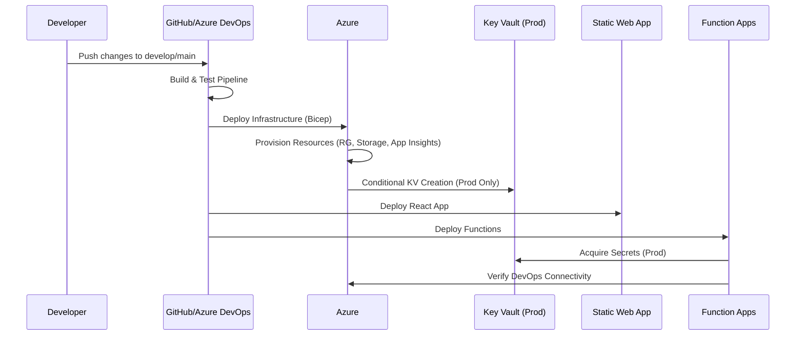

# Phase 1: Foundation Implementation Plan

## Overview
This document provides the detailed implementation plan for Phase 1 (Foundation) of the SDR Management System, covering Azure environments, DevOps integration, authentication, application frameworks, and infrastructure as code.

## Infrastructure Architecture

```mermaid
graph TB
    subgraph "Azure Environments (All Env)"
        RG[Resource Groups<br/>rg-sdr-{env}-{region}]
        ST[Storage Account<br/>stsdr{env}{region}001<br/>Containers: attachments, ai-processing, exports]
        AI[Application Insights<br/>ai-sdr-{env}-{region}<br/>Log Analytics: law-sdr-{env}-{region}]
    end

    subgraph "Production Only"
        KV[Key Vault<br/>kv-sdr-prod-{region}<br/>Secrets: PAT tokens, API keys, certs<br/>Access: Function Apps]
    end

    subgraph "Authentication Layer"
        AAD[Azure Active Directory<br/>App Registration: sdr-{env}<br/>MSAL Integration<br/>RBAC Policies]
    end

    subgraph "Application Layer"
        SWA[Static Web App<br/>swa-sdr-{env}-{region}<br/>Framework: React/TypeScript<br/>Auth Routes, Material-UI]
        AF[Azure Functions<br/>func-sdr-{env}-{region}<br/>API Endpoints: SDR CRUD<br/>DevOps Service Integration]
    end

    subgraph "DevOps Integration"
        ADO[Azure DevOps Project<br/>sdr-{env}<br/>Custom Work Item: SDR Request<br/>PAT Tokens via Key Vault/Env]
    end

    subgraph "Deployment Pipeline"
        CI[Build Pipeline<br/>- Lint & Test<br/>- Build Apps<br/>- Validate IaC]
        CD[Release Pipeline<br/>- Infra Deploy (Bicep)<br/>- App Deploy<br/>- Post-deploy Tests]

        CI --> CD
    end

    AAD -->|Authentication| SWA
    AAD -->|Token Validation| AF
    SWA -->|API Calls| AF

    AF -->|Secret Access<br/>Prod: Key Vault<br/>Dev/Test: Env Vars| KV
    KV -.->|Conditional<br/>Prod Only| ST

    AF -->|Work Item CRUD| ADO
    AF -->|Logs & Metrics| AI
    AF -->|File Storage| ST

    CD -->|Provision| RG
    CD -->|Provision| ST
    CD -->|Provision| AI
    CD -->|Conditional| KV

    CD -->|Deploy| SWA
    CD -->|Deploy| AF

    style KV fill:#ffcccc
    style RG fill:#e1f5fe
    style ST fill:#e1f5fe
    style AI fill:#e1f5fe
```

## Environment-Specific Configurations

### Production Environment
```json
{
  "environment": "prod",
  "resource_suffix": "prod-uksouth",
  "secrets": {
    "keyVault": "kv-sdr-prod-uksouth",
    "devopsPat": "https://dev.azure.com/{org}/_apis/token/sessiontokens?api-version=7.0",
    "requiredSecrets": [
      "devops-pat-token",
      "openai-api-key",
      "form-recognizer-key",
      "storage-connection-string",
      "bot-app-password"
    ]
  },
  "skuTier": "Premium",
  "enableMonitoring": true,
  "privateEndpoints": true,
  "backupRetention": 90
}
```

### Development Environment
```json
{
  "environment": "dev",
  "resource_suffix": "dev-uksouth",
  "secrets": {
    "approach": "Environment Variables",
    "fallback": ".env.dev",
    "devTokenRotation": 30
  },
  "skuTier": "Free/Consumption",
  "enableMonitoring": true,
  "publicNetwork": true
}
```

## Component Implementations

### 1. Bicep Infrastructure Templates
Location: `infrastructure/bicep/`
- **main.bicep**: Master template with conditional resource deployment
- **modules/core-infrastructure.bicep**: Storage, Key Vault (prod), App Insights
- **modules/application-services.bicep**: Function Apps, Static Web Apps
- Environment parameters in `infrastructure/parameters/{env}.json`

Key Features:
- Conditional Key Vault deployment (`if (environment == 'prod')`)
- Environment-specific SKU selection
- Proper tagging and naming per standards
- Identity assignment for secure access

### 2. CI/CD Pipeline Configurations
Location: `.github/workflows/` (or `.devops/` for Azure DevOps)

**Multi-Stage Pipeline:**
- Build: Frontend (React), Backend (Functions), IaC (Bicep)
- Deploy-Dev: Conditional infrastructure provisioning + application deployment
- Deploy-Prod: Production environment with approvals and monitoring
- Security scanning and testing gates

**Environment-Specific**:
- Dev: Automatic deployment on merge to develop
- Prod: Manual approval gate + production secrets validation

### 3. Azure DevOps Project Configuration
Location: `infrastructure/scripts/setup-devops.ps1`

Templates for:
- Project creation with custom work item types
- "SDR Request" work item definition with custom fields
- PAT token configuration and Key Vault integration
- Query definitions for SDR tracking and reporting

### 4. Authentication Framework
Location: `apps/frontend/src/features/auth/`

**Azure AD Integration:**
- MSAL React library configuration
- Protected route wrapper components
- User role management and RBAC
- Token refresh and session handling

**Role-Based Access**:
- SDR Creator: Can create and view own SDRs
- Developer: Can assign and update SDRs
- Approver: Can approve/reject SLR requests
- Administrator: Full system access

### 5. React Frontend Structure
Location: `apps/frontend/`
Framework: React 18 + TypeScript + Vite

**Feature-Based Architecture:**
```
src/
├── features/
│   ├── auth/         # Authentication components and logic
│   ├── sdr/          # SDR management components
│   └── shared/       # Common UI components
├── app/              # App shell and routing
└── config/           # Environment configuration
```

Key Features:
- Material-UI component library
- React Router with protected routes
- Form validation with React Hook Form
- API integration with RTK Query
- Progressive web app capabilities

### 6. Azure Functions Backend Structure
Location: `apps/api/`
Framework: Azure Functions v4 + Node.js + TypeScript

**Function Organization:**
```
src/
├── functions/
│   ├── sdr/          # CRUD operations
│   ├── files/        # File upload/download
│   ├── ai/           # AI processing
│   └── notifications/# Teams/email notifications
├── shared/
│   ├── services/     # DevOps, AI, Storage services
│   └── middleware/   # Auth, validation, error handling
```

Key Services:
- **DevOpsService**: PAT-based work item management with retry logic
- **AIService**: OpenAI integration for content extraction
- **StorageService**: Blob storage operations with security
- **AuthMiddleware**: Azure AD token validation

### 7. Secret Management Strategy

**Production:**
```typescript
// Key Vault integration
const secretClient = new SecretClient(keyVaultUrl, credential);
const patToken = await secretClient.getSecret('devops-pat-token');
```

**Development/Testing:**
```typescript
// Environment variables fallback
const fallbackService = {
  getSecret(name: string) {
    return process.env[name.toUpperCase()] || this.getMockValue(name);
  },
  getMockValue(name: string) {
    // Mock values for CI/testing
    return `mock-${name}`;
  }
};
```

## Deployment Flow



## Security Considerations

- **Network Security**: VNet integration, private endpoints (prod)
- **Access Control**: System-assigned identities, RBAC policies
- **Data Protection**: Encryption at rest, HTTPS everywhere
- **Monitoring**: Comprehensive logging, alerts, and auditing
- **Secret Rotation**: Automated rotation policies (prod)

## Implementation Order

1. Infrastructure templates and pipeline setup
2. Authentication framework and AAD configuration
3. React application scaffold and routing
4. Azure Functions API structure and services
5. DevOps project configuration
6. Testing and validation
7. Deployment and monitoring setup

## Next Steps

This plan will be implemented by switching to Code mode and executing each todo item systematically. The implementation will produce deployable infrastructure, applications, and configurations ready for production use.