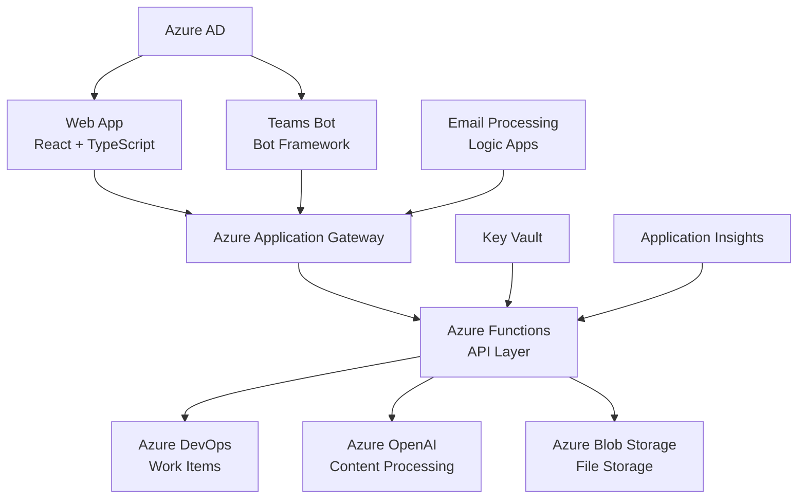

# SDR Management System

> **Small Development Request Management Platform**  
> A comprehensive Azure-based solution for managing development requests with AI-powered content processing and Microsoft Teams integration.

[](https://dev.azure.com/yourorg/SDR/_build/latest?definitionId=1&branchName=main)
[](https://sonarcloud.io/summary/new_code?id=sdr-management)
[](https://sonarcloud.io/summary/new_code?id=sdr-management)
[](https://opensource.org/licenses/MIT)

---

## 🚀 Quick Start

```bash
# Clone the repository
git clone https://github.com/yourorg/sdr-management-system.git
cd sdr-management-system

# Install dependencies
npm run install:all

# Setup environment
cp .env.example .env
# Edit .env with your configuration

# Start development environment
npm run dev
```

**Access the application:** http://localhost:3000

---

## 📋 Table of Contents

- [Overview](#-overview)
- [Features](#-features)
- [Architecture](#-architecture)
- [Getting Started](#-getting-started)
- [Development](#-development)
- [Deployment](#-deployment)
- [API Documentation](#-api-documentation)
- [Testing](#-testing)
- [Contributing](#-contributing)
- [Support](#-support)

---

## 🎯 Overview

The SDR Management System streamlines the process of creating, tracking, and managing Small Development Requests within an organization. Built on Microsoft Azure with DevOps-centric architecture, it provides multiple input methods, AI-powered content processing, and seamless workflow automation.

### Key Benefits

- **📝 Multiple Input Methods**: Web forms, email processing, file uploads, and Microsoft Teams Bot
- **🤖 AI-Powered Processing**: Automatic extraction of SDR details from emails and documents
- **⚡ DevOps Integration**: Direct integration with Azure DevOps for work item management
- **🔒 Enterprise Security**: Zero-trust architecture with comprehensive security controls
- **📱 Cross-Platform**: Responsive web app with Teams integration and PWA support

---

## ✨ Features

### Core Functionality
- **SDR Creation & Management**
  - Web-based form submission
  - Email-to-SDR conversion with AI processing
  - File upload with automatic content extraction
  - Microsoft Teams Bot integration
  
- **Workflow Automation**
  - Automatic developer assignment
  - Approval workflows for high-effort requests
  - Status tracking and notifications
  - SLA monitoring and escalation

- **User Experience**
  - Role-based dashboards (End User, Developer, Manager)
  - Real-time status updates
  - Mobile-responsive design
  - Progressive Web App (PWA) capabilities

### Advanced Features
- **AI Content Processing**
  - Email content extraction using Azure OpenAI
  - Document analysis with Form Recognizer
  - Intelligent field population and validation

- **Microsoft Teams Integration**
  - Conversational SDR creation
  - Status notifications and updates
  - Quick actions and approvals
  - Proactive notifications

- **Reporting**
  - Basic reporting capabilities
  - Team capacity planning

---

## 🏗 Architecture

### System Overview



### Technology Stack

| Layer | Technology | Purpose |
|-------|------------|---------|
| **Frontend** | React 18 + TypeScript | User interface |
| **API Gateway** | Azure Application Gateway | Load balancing, WAF |
| **Backend** | Azure Functions (Node.js) | Serverless API |
| **AI Services** | Azure OpenAI + Cognitive Services | Content processing |
| **Teams Bot** | Bot Framework SDK v4 | Conversational interface |
| **Primary Storage** | Azure DevOps Work Items | Data persistence |
| **File Storage** | Azure Blob Storage | Document management |
| **Authentication** | Azure Active Directory | Identity management |
| **Monitoring** | Application Insights | Observability |
| **Infrastructure** | Azure Bicep + ARM | Infrastructure as Code |

---

## 🚀 Getting Started

### Prerequisites

- **Node.js** 18.x or higher
- **Azure CLI** 2.40+ 
- **Azure Subscription** with appropriate permissions
- **Azure DevOps Organization** 
- **Git** for version control

### Development Environment Setup

1. **Clone and Install**
   ```bash
   git clone https://github.com/yourorg/sdr-management-system.git
   cd sdr-management-system
   npm run install:all
   ```

2. **Azure Resources Setup**
   ```bash
   # Login to Azure
   az login
   
   # Create resource group
   az group create --name rg-sdr-dev --location eastus
   
   # Deploy infrastructure
   az deployment group create \
     --resource-group rg-sdr-dev \
     --template-file infrastructure/main.bicep \
     --parameters environment=dev
   ```

3. **Environment Configuration**
   ```bash
   cp .env.example .env
   # Edit .env with your specific values:
   # - Azure DevOps organization and PAT token
   # - Azure OpenAI endpoint and key
   # - Storage account connection string
   # - Application Insights connection string
   ```

4. **DevOps Projects Setup**
   ```bash
   # Run the setup script
   npm run setup:devops
   ```

5. **Start Development Servers**
   ```bash
   # Start all services
   npm run dev
   
   # Or start individually
   npm run dev:frontend    # React app on :3000
   npm run dev:functions   # Azure Functions on :7071
   npm run dev:bot        # Teams Bot on :3978
   ```

### Verification

- ✅ **Frontend**: http://localhost:3000
- ✅ **API Health**: http://localhost:7071/api/health
- ✅ **Bot Emulator**: Use Bot Framework Emulator to test Teams Bot

---

## 💻 Development

### Project Structure

```
sdr-management-system/
├── frontend/                 # React application
│   ├── src/
│   │   ├── components/      # Reusable UI components
│   │   ├── features/        # Feature-based modules
│   │   ├── services/        # API clients
│   │   ├── hooks/           # Custom React hooks
│   │   └── types/           # TypeScript definitions
│   └── public/
├── functions/               # Azure Functions
│   ├── src/
│   │   ├── functions/       # Function endpoints
│   │   ├── services/        # Business logic
│   │   ├── shared/          # Shared utilities
│   │   └── types/           # Type definitions
│   └── host.json
├── teams-bot/              # Microsoft Teams Bot
│   ├── src/
│   │   ├── bots/           # Bot implementation
│   │   ├── dialogs/        # Conversation flows
│   │   ├── cards/          # Adaptive cards
│   │   └── services/       # Bot services
│   └── manifest.json
├── infrastructure/         # Infrastructure as Code
│   ├── bicep/             # Bicep templates
│   ├── parameters/        # Environment parameters
│   └── scripts/           # Deployment scripts
├── tests/                 # Test suites
│   ├── unit/             # Unit tests
│   ├── integration/      # Integration tests
│   ├── e2e/              # End-to-end tests
│   └── performance/      # Load tests
└── docs/                 # Documentation
    ├── api/              # API documentation
    ├── architecture/     # Technical docs
    └── user/             # User guides
```

### Development Commands

```bash
# Install dependencies for all projects
npm run install:all

# Development servers
npm run dev                    # Start all services
npm run dev:frontend          # React development server
npm run dev:functions         # Azure Functions local runtime
npm run dev:bot              # Teams Bot local server

# Building
npm run build                 # Build all projects
npm run build:frontend        # Build React app
npm run build:functions       # Build Functions app
npm run build:bot            # Build Teams Bot

# Testing
npm run test                  # Run all tests
npm run test:unit            # Unit tests only
npm run test:integration     # Integration tests
npm run test:e2e             # End-to-end tests
npm run test:coverage        # Test coverage report

# Code quality
npm run lint                  # ESLint check
npm run lint:fix             # Fix ESLint issues
npm run format               # Prettier formatting
npm run type-check           # TypeScript type checking

# Database and DevOps
npm run setup:devops         # Setup DevOps projects
npm run seed:data            # Seed test data
npm run migrate:up           # Run database migrations
npm run clean:data           # Clean test data
```

### Environment Variables

Create a `.env` file in the root directory:

```bash
# Azure Configuration
AZURE_TENANT_ID=your-tenant-id
AZURE_CLIENT_ID=your-client-id
AZURE_CLIENT_SECRET=your-client-secret
AZURE_SUBSCRIPTION_ID=your-subscription-id

# Azure DevOps
DEVOPS_ORGANIZATION=your-devops-org
DEVOPS_PAT_TOKEN=your-pat-token
DEVOPS_PROJECT_GENERAL=SDR-General
DEVOPS_PROJECT_CRITICAL=SDR-Critical
DEVOPS_PROJECT_EXTERNAL=SDR-External

# Azure Services
OPENAI_ENDPOINT=https://your-openai.openai.azure.com/
OPENAI_API_KEY=your-openai-key
FORM_RECOGNIZER_ENDPOINT=https://your-fr.cognitiveservices.azure.com/
FORM_RECOGNIZER_KEY=your-fr-key
STORAGE_CONNECTION_STRING=your-storage-connection-string
APPLICATIONINSIGHTS_CONNECTION_STRING=your-appinsights-connection

# Teams Bot
BOT_APP_ID=your-bot-app-id
BOT_APP_PASSWORD=your-bot-app-password

# Development Settings
NODE_ENV=development
LOG_LEVEL=debug
ENABLE_SWAGGER=true
```

---

## 🚢 Deployment

### Deployment Environments

| Environment | URL | Purpose |
|-------------|-----|---------|
| **Development** | https://sdr-dev.yourcompany.com | Feature development |
| **Testing** | https://sdr-test.yourcompany.com | QA and integration testing |
| **Staging** | https://sdr-stage.yourcompany.com | Pre-production validation |
| **Production** | https://sdr.yourcompany.com | Live system |

### Automated Deployment

The system uses Azure DevOps Pipelines for CI/CD:

1. **Continuous Integration**
   - Triggered on pull requests to `main` or `develop`
   - Runs unit tests, integration tests, security scans
   - Quality gates prevent merge if standards not met

2. **Continuous Deployment**
   - `develop` branch → Development environment
   - `main` branch → Staging → Production (with approval)

3. **Manual Deployment**
   ```bash
   # Deploy to specific environment
   npm run deploy:dev
   npm run deploy:staging
   npm run deploy:prod     # Requires approval
   ```

### Infrastructure Deployment

```bash
# Deploy infrastructure for environment
az deployment group create \
  --resource-group rg-sdr-prod \
  --template-file infrastructure/main.bicep \
  --parameters @infrastructure/parameters/prod.json
```

### Post-Deployment Verification

```bash
# Health check
curl -f https://sdr.yourcompany.com/api/health

# Run smoke tests
npm run test:smoke -- --environment production
```

---

## 📚 API Documentation

### Authentication

All API endpoints require Azure AD Bearer token authentication:

```bash
curl -H "Authorization: Bearer <your-token>" \
     https://func-sdr-prod.azurewebsites.net/api/sdr
```

### Core Endpoints

#### SDR Management

```http
GET /api/sdr                    # List user's SDRs
POST /api/sdr                   # Create new SDR
GET /api/sdr/{id}              # Get specific SDR
PUT /api/sdr/{id}              # Update SDR
DELETE /api/sdr/{id}           # Delete SDR
```

#### File Operations

```http
POST /api/files/upload         # Upload file
GET /api/files/{id}            # Download file
DELETE /api/files/{id}         # Delete file
```


### OpenAPI Specification

Interactive API documentation is available at:
- **Development**: http://localhost:7071/api/swagger
- **Production**: https://func-sdr-prod.azurewebsites.net/api/swagger

---

## 🧪 Testing

### Test Strategy

The project follows the test pyramid approach:

```
     E2E Tests (10%)          ← Playwright, full user journeys
   Integration Tests (20%)     ← API testing, service integration  
      Unit Tests (70%)        ← Jest, component/function testing
```

### Running Tests

```bash
# All tests
npm run test

# Specific test types
npm run test:unit              # Fast feedback loop
npm run test:integration       # Service interaction tests
npm run test:e2e              # Full user journey tests
npm run test:performance      # Load and stress tests

# Test coverage
npm run test:coverage         # Generate coverage report
open coverage/lcov-report/index.html

# Continuous testing
npm run test:watch            # Watch mode for development
```

### Test Configuration

Tests are configured with quality gates:

- **Unit Tests**: ≥80% coverage, 100% pass rate
- **Integration Tests**: ≥70% coverage, 100% pass rate
- **E2E Tests**: ≥90% critical path coverage
- **Performance**: API responses <500ms, UI loads <3s

### Test Data Management

```bash
# Setup test environment
npm run test:setup

# Seed test data
npm run test:seed

# Cleanup after tests
npm run test:cleanup
```

---

## 🤝 Contributing

We welcome contributions! Please see our [Contributing Guidelines](CONTRIBUTING.md) for details.

### Development Workflow

1. **Fork** the repository
2. **Create** a feature branch: `git checkout -b feature/amazing-feature`
3. **Commit** your changes: `git commit -m 'Add amazing feature'`
4. **Push** to the branch: `git push origin feature/amazing-feature`
5. **Open** a Pull Request

### Code Standards

- **TypeScript** for type safety
- **ESLint + Prettier** for code formatting
- **Conventional Commits** for commit messages
- **Jest** for testing
- **Husky** for pre-commit hooks

### Pull Request Process

- Ensure all tests pass
- Update documentation as needed
- Add tests for new functionality
- Follow code review checklist
- Obtain approval from maintainers

---

## 📖 Documentation

### User Documentation
- **[User Guide](docs/user/user-guide.md)** - End user instructions
- **[Administrator Guide](docs/user/admin-guide.md)** - System administration
- **[Teams Bot Guide](docs/user/teams-bot-guide.md)** - Microsoft Teams usage

### Technical Documentation
- **[Technical Architecture](Technical_Architecture_Document.md)** - System design
- **[Development Plan](SDR_Development_Plan.md)** - Implementation roadmap
- **[Security Requirements](Security_Requirements_Document.md)** - Security framework
- **[Infrastructure Standards](Infrastructure_DevOps_Standards.md)** - DevOps practices
- **[Testing Strategy](Testing_Strategy_QA_Plan.md)** - QA approach

### API Documentation
- **[API Reference](docs/api/api-reference.md)** - Detailed API documentation
- **[OpenAPI Spec](docs/api/openapi.yaml)** - Machine-readable API specification
- **[Integration Guide](docs/api/integration-guide.md)** - Third-party integration

---

## 🔧 Troubleshooting

### Common Issues

#### Authentication Issues
```bash
# Check Azure AD token
az account get-access-token --resource https://graph.microsoft.com

# Verify DevOps PAT token permissions
curl -u ":$PAT_TOKEN" https://dev.azure.com/{org}/_apis/projects
```

#### Development Server Issues
```bash
# Clear node modules and reinstall
rm -rf node_modules package-lock.json
npm install

# Reset local Functions runtime
func extensions install --force
```

#### Database Connection Issues
```bash
# Test DevOps API connectivity
npm run test:devops-connection

# Validate work item queries
npm run validate:queries
```

### Support Channels

- **🐛 Bug Reports**: [GitHub Issues](https://github.com/yourorg/sdr-management/issues)
- **💬 Discussions**: [GitHub Discussions](https://github.com/yourorg/sdr-management/discussions)
- **📧 Email Support**: sdr-support@yourcompany.com
- **👥 Teams Channel**: SDR Management System
- **📚 Internal Wiki**: [Confluence Space](https://yourcompany.atlassian.net/wiki/spaces/SDR)

### Health Checks

```bash
# System health
curl https://sdr.yourcompany.com/api/health

# Detailed diagnostics
npm run diagnostics

# Performance check
npm run health:performance
```

---

## 📊 Monitoring & Health

### Application Monitoring

- **Application Insights**: Real-time performance and usage analytics
- **Azure Monitor**: Infrastructure health and alerting
- **Custom Dashboards**: Business metrics and KPIs

### Key Metrics

- **Performance**: API response times, page load times
- **Usage**: Active users, SDR creation rate, feature adoption
- **Quality**: Error rates, availability, user satisfaction
- **Business**: Processing time reduction, developer productivity

### Accessing Dashboards

- **System Health**: [Azure Portal](https://portal.azure.com/#@tenant/resource/subscriptions/sub-id/resourceGroups/rg-sdr-prod/providers/Microsoft.Insights/components/ai-sdr-prod)

---

## 🔒 Security

### Security Features

- **Zero Trust Architecture**: Never trust, always verify
- **Azure AD Integration**: Enterprise identity and access management
- **Data Encryption**: At rest and in transit using Azure Key Vault
- **Network Security**: Application Gateway with WAF protection
- **Audit Logging**: Comprehensive activity tracking
- **Compliance**: GDPR, SOC 2, industry standards

### Security Reporting

- **Vulnerability Scans**: Automated daily scans with Dependabot
- **Security Alerts**: Real-time notifications for security events
- **Compliance Reports**: Regular compliance assessment reports

### Incident Response

For security incidents:
1. **Immediate**: Email security@yourcompany.com
2. **Non-urgent**: Create issue with `security` label
3. **Internal**: Teams channel #security-incidents

---

## 📄 License

This project is licensed under the MIT License - see the [LICENSE](LICENSE) file for details.

---

## 🎉 Acknowledgments

- **Microsoft Azure** for cloud platform services
- **Azure DevOps** for project management and CI/CD
- **OpenAI** for AI content processing capabilities
- **Bot Framework** for Microsoft Teams integration
- **React Community** for frontend framework and ecosystem

---

## 📈 Roadmap

### Current Release (v1.0)
- ✅ Core SDR management functionality
- ✅ Azure DevOps integration
- ✅ Microsoft Teams Bot
- ✅ AI content processing
- ✅ Web application with responsive design

### Next Release (v1.1)
- 🔄 Mobile application (React Native)
- 🔄 SharePoint integration
- 🔄 Advanced workflow customization

### Future Releases
- 📋 Power Platform integration
- 📋 Multi-language support
- 📋 Advanced AI features
- 📋 Third-party system integrations

---

## 💡 Support

Need help? We're here for you!

### Quick Links
- 📖 [Documentation](docs/)
- 🐛 [Report Bug](https://github.com/yourorg/sdr-management/issues/new?template=bug_report.md)
- 💡 [Request Feature](https://github.com/yourorg/sdr-management/issues/new?template=feature_request.md)
- 💬 [Join Discussion](https://github.com/yourorg/sdr-management/discussions)

### Contact Information
- **Product Owner**: product.owner@yourcompany.com
- **Technical Lead**: tech.lead@yourcompany.com
- **Support Team**: sdr-support@yourcompany.com

---

<div align="center">
  <p>Made with ❤️ by the SDR Management Team</p>
  <p>
    <a href="https://github.com/yourorg/sdr-management">⭐ Star us on GitHub</a> •
    <a href="https://twitter.com/yourcompany">🐦 Follow on Twitter</a> •
    <a href="https://linkedin.com/company/yourcompany">💼 Connect on LinkedIn</a>
  </p>
</div>