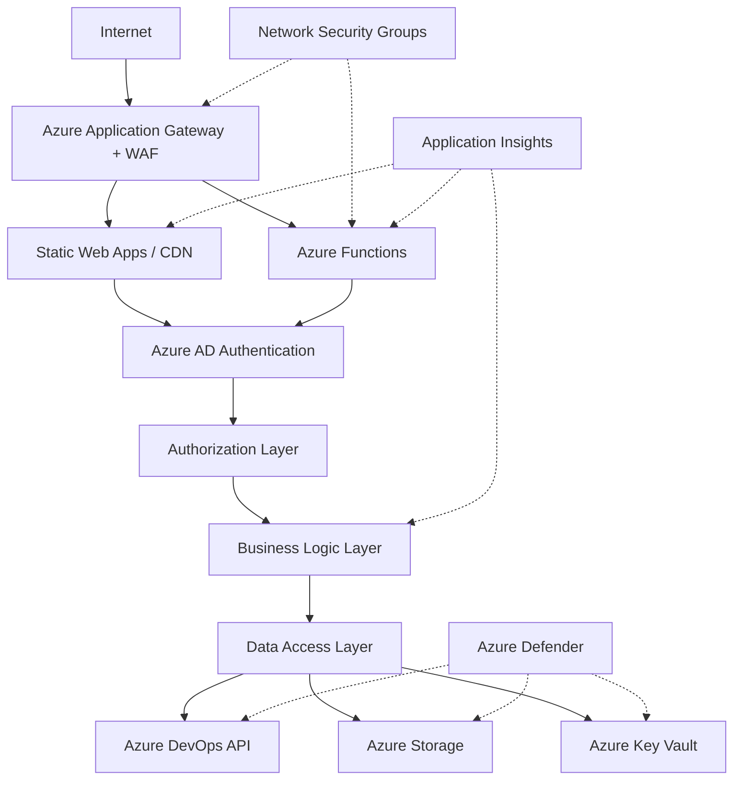

# Security Requirements Document
## SDR Management System Security Framework

**Document Version:** 1.0  
**Date:** August 30, 2025  
**Author:** Security Architect / CISO  
**Project:** SDR Management System Security Requirements  
**Classification:** Confidential

---

## 1. Executive Summary

This Security Requirements Document defines the comprehensive security framework for the SDR Management System, including threat models, security controls, compliance requirements, and implementation guidelines. The document ensures the system meets enterprise security standards and regulatory requirements while maintaining usability and performance.

### 1.1 Security Objectives

- **Confidentiality**: Protect sensitive SDR data and business information
- **Integrity**: Ensure data accuracy and prevent unauthorized modifications
- **Availability**: Maintain system uptime and resilience against attacks
- **Accountability**: Provide complete audit trails and access logging
- **Compliance**: Meet regulatory and organizational security requirements

### 1.2 Scope

This document covers security requirements for all components of the SDR Management System including:
- Web application frontend and backend services
- Microsoft Teams Bot integration
- Azure DevOps integration and data storage
- AI services and content processing
- File storage and management systems
- Infrastructure and network security

---

## 2. Threat Model Analysis

### 2.1 Threat Landscape

#### 2.1.1 External Threats
```
High Risk Threats:
├── Web Application Attacks
│   ├── SQL Injection (via DevOps API)
│   ├── Cross-Site Scripting (XSS)
│   ├── Cross-Site Request Forgery (CSRF)
│   └── Authentication Bypass
├── API Security Threats
│   ├── Broken Authentication
│   ├── Excessive Data Exposure
│   ├── Rate Limiting Bypass
│   └── Injection Attacks
├── Data Breaches
│   ├── Unauthorized Access to DevOps
│   ├── Storage Account Compromise
│   ├── Key Vault Breach
│   └── AI Service Data Leakage
└── Infrastructure Attacks
    ├── DDoS Attacks
    ├── Man-in-the-Middle
    ├── Certificate Attacks
    └── Cloud Misconfigurations
```

#### 2.1.2 Internal Threats
```
Medium Risk Threats:
├── Privilege Escalation
│   ├── Insider Threats
│   ├── Account Compromise
│   └── Role Mining Attacks
├── Data Exfiltration
│   ├── Unauthorized Downloads
│   ├── Email Data Theft
│   └── Screen Scraping
├── Social Engineering
│   ├── Teams Bot Impersonation
│   ├── Phishing via AI-generated Content
│   └── Business Email Compromise
└── Accidental Exposure
    ├── Misconfigured Permissions
    ├── Over-privileged Accounts
    └── Data Classification Errors
```

### 2.2 Asset Classification

| Asset Type | Classification | Threat Level | Protection Requirements |
|------------|---------------|--------------|------------------------|
| Customer SDR Data | Confidential | High | Encryption, Access Controls, Audit |
| Internal SDR Data | Internal | Medium | Access Controls, Audit |
| User Credentials | Restricted | Critical | MFA, Encryption, Rotation |
| API Keys/Tokens | Restricted | Critical | Key Vault, Rotation, Monitoring |
| System Logs | Internal | Medium | Retention, Access Controls |
| Application Code | Internal | Low | Source Control, Code Review |

### 2.3 Attack Surface Analysis

```typescript
interface AttackSurface {
  webApplication: {
    endpoints: string[];
    authenticationMethods: string[];
    inputVectors: string[];
    outputChannels: string[];
    riskLevel: 'High' | 'Medium' | 'Low';
  };
  
  apis: {
    azureFunctions: {
      publicEndpoints: number;
      authenticationRequired: boolean;
      riskLevel: 'High';
    };
    devOpsAPI: {
      accessMethod: 'PAT Token';
      dataExposure: 'Work Items, Comments';
      riskLevel: 'High';
    };
    aiServices: {
      dataProcessing: 'Email Content, Documents';
      riskLevel: 'Medium';
    };
  };
  
  infrastructure: {
    azureServices: {
      staticWebApps: { publicAccess: true; riskLevel: 'Medium'; };
      functionApps: { publicAccess: true; riskLevel: 'High'; };
      storageAccounts: { publicAccess: false; riskLevel: 'Medium'; };
      keyVault: { publicAccess: false; riskLevel: 'Critical'; };
    };
  };
}
```

---

## 3. Security Architecture Requirements

### 3.1 Zero Trust Security Model

#### 3.1.1 Trust Principles
```typescript
const zeroTrustPrinciples = {
  neverTrust: "Never trust, always verify every request",
  leastPrivilege: "Grant minimum required access for specific tasks",
  assumeBreach: "Design systems assuming compromise has occurred",
  verifyExplicitly: "Authenticate and authorize every transaction",
  monitorEverything: "Log and analyze all security-relevant events"
};

// Implementation across system layers
const zeroTrustImplementation = {
  identity: {
    multiFactorAuthentication: "Required for all users",
    conditionalAccess: "Risk-based authentication policies",
    privilegedAccessManagement: "Just-in-time access for admins",
    identityGovernance: "Regular access reviews and certification"
  },
  
  devices: {
    deviceCompliance: "Managed device requirements",
    deviceTrust: "Certificate-based device authentication",
    appProtection: "Mobile application management policies"
  },
  
  network: {
    microsegmentation: "Network isolation by function",
    encryptedCommunication: "TLS 1.3 for all connections",
    networkMonitoring: "Real-time traffic analysis",
    zeroNetworkTrust: "No implicit trust of network location"
  },
  
  applications: {
    applicationSecurity: "Secure development practices",
    apiProtection: "OAuth 2.0 + rate limiting",
    applicationFirewall: "WAF with OWASP rule sets",
    runtimeProtection: "Application security monitoring"
  },
  
  data: {
    dataClassification: "Automated data discovery and labeling",
    dataProtection: "Encryption, DLP, and access controls",
    informationGovernance: "Retention and disposal policies",
    dataMonitoring: "Data access and movement tracking"
  }
};
```

### 3.2 Defense in Depth Strategy



### 3.3 Security Control Framework

#### 3.3.1 Identity and Access Management (IAM)

```typescript
interface IAMRequirements {
  authentication: {
    primaryMethod: "Azure Active Directory";
    multiFactorAuthentication: {
      required: true;
      methods: ["Microsoft Authenticator", "SMS", "Phone Call"];
      riskBasedPolicy: true;
    };
    sessionManagement: {
      maxSessionDuration: "8 hours";
      idleTimeout: "30 minutes";
      concurrentSessions: 3;
    };
    passwordPolicy: {
      complexity: "AAD Default + Company Policy";
      rotation: "90 days for service accounts";
      history: 12;
      lockoutThreshold: 3;
    };
  };
  
  authorization: {
    model: "Role-Based Access Control (RBAC)";
    principleOfLeastPrivilege: true;
    roles: {
      endUser: {
        permissions: ["create_sdr", "view_own_sdr", "comment_own_sdr"];
        restrictions: ["no_delete", "no_admin_functions"];
      };
      developer: {
        permissions: ["view_assigned_sdr", "update_sdr", "estimate_effort"];
        restrictions: ["no_approve_high_value", "no_user_management"];
      };
      manager: {
        permissions: ["approve_sdr", "view_all_sdr", "assign_developers"];
        restrictions: ["no_system_config", "no_security_settings"];
      };
      systemAdmin: {
        permissions: ["all_system_functions", "user_management", "security_config"];
        restrictions: ["requires_break_glass_approval"];
      };
    };
    accessReview: {
      frequency: "Quarterly";
      autoRemoval: "After 90 days inactive";
      approvalRequired: "Manager + Security Team";
    };
  };
  
  privilegedAccessManagement: {
    justInTimeAccess: true;
    approvalWorkflow: "Dual approval for admin access";
    sessionRecording: "For privileged operations";
    maxPrivilegedSessionDuration: "2 hours";
  };
}
```

#### 3.3.2 Data Protection Requirements

```typescript
interface DataProtectionRequirements {
  encryption: {
    atRest: {
      algorithm: "AES-256";
      keyManagement: "Azure Key Vault with HSM backing";
      storageAccount: "Customer-managed keys";
      devOpsData: "Microsoft-managed encryption";
      rotationPolicy: "Annual key rotation";
    };
    inTransit: {
      protocol: "TLS 1.3 minimum";
      certificateManagement: "Azure Key Vault certificates";
      perfectForwardSecrecy: true;
      cipherSuites: ["TLS_AES_256_GCM_SHA384", "TLS_CHACHA20_POLY1305_SHA256"];
    };
    inProcessing: {
      aiServices: "Confidential computing where available";
      memoryProtection: "Secure memory allocation";
      temporaryFiles: "Encrypted temporary storage";
    };
  };
  
  dataClassification: {
    categories: {
      public: "Marketing materials, public documentation";
      internal: "Standard business data, internal SDRs";
      confidential: "Customer data, employee information";
      restricted: "Authentication credentials, encryption keys";
    };
    labelingRequirement: "Automated classification for all data";
    handlingProcedures: "Role-based access based on classification";
  };
  
  dataLossPrevention: {
    contentInspection: "Scan all file uploads and emails";
    policyEnforcement: "Block/quarantine sensitive data";
    userEducation: "Notifications on policy violations";
    reportingEscalation: "Security team notification on violations";
  };
  
  backupSecurity: {
    backupEncryption: "Separate encryption keys for backups";
    accessControl: "Dedicated backup administrator role";
    testing: "Monthly backup restoration tests";
    offSiteStorage: "Geo-redundant secure storage";
  };
  
  dataRetention: {
    sdrData: "7 years per company policy";
    auditLogs: "3 years minimum";
    temporaryProcessing: "24 hours maximum";
    userData: "Subject to GDPR deletion rights";
    automaticDeletion: "Automated cleanup procedures";
  };
}
```

#### 3.3.3 Network Security Requirements

```typescript
interface NetworkSecurityRequirements {
  perimeter: {
    webApplicationFirewall: {
      provider: "Azure Application Gateway WAF";
      ruleSets: ["OWASP Core Rule Set 3.2", "Custom Rules"];
      preventionMode: true;
      logAllRequests: true;
      customRules: [
        "Block requests from known malicious IPs",
        "Rate limiting per client IP",
        "Geographic restrictions if required",
        "Bot protection and CAPTCHA integration"
      ];
    };
    
    ddosProtection: {
      standard: "Azure DDoS Protection Standard";
      alerting: "Real-time attack notifications";
      mitigation: "Automatic traffic scrubbing";
      reporting: "Post-attack analysis reports";
    };
  };
  
  networkSegmentation: {
    virtualNetworks: {
      production: "10.0.0.0/16";
      staging: "10.1.0.0/16"; 
      development: "10.2.0.0/16";
    };
    subnets: {
      webTier: "10.0.1.0/24";
      appTier: "10.0.2.0/24";
      dataTier: "10.0.3.0/24";
      management: "10.0.100.0/24";
    };
    networkSecurityGroups: {
      webTierNSG: "Allow 80/443 from internet, block all other inbound";
      appTierNSG: "Allow from web tier only";
      dataTierNSG: "Allow from app tier only";
      managementNSG: "Allow RDP/SSH from management network only";
    };
  };
  
  privateConnectivity: {
    privateEndpoints: {
      keyVault: "Private endpoint for Key Vault access";
      storageAccount: "Private endpoint for blob storage";
      devOpsServices: "If available in region";
    };
    serviceEndpoints: "For Azure PaaS services where private endpoints not available";
    expressRoute: "Dedicated connection to corporate network if required";
  };
  
  certificateManagement: {
    certificates: "Azure Key Vault managed certificates";
    automation: "Automatic renewal 30 days before expiration";
    monitoring: "Certificate expiration alerting";
    validation: "Domain validation for public certificates";
  };
}
```

---

## 4. Application Security Requirements

### 4.1 Secure Development Lifecycle (SDLC)

#### 4.1.1 Security in Development Process

```yaml
sdlc_security_requirements:
  planning:
    - threat_modeling: "Required for each feature"
    - security_requirements: "Defined in user stories"
    - risk_assessment: "DREAD methodology"
    
  design:
    - architecture_review: "Security architect approval required"
    - data_flow_analysis: "Document all data flows"
    - trust_boundaries: "Identify and secure all boundaries"
    
  development:
    - secure_coding_standards: "OWASP guidelines"
    - code_analysis: "Static analysis on every commit"
    - dependency_scanning: "Automated vulnerability scanning"
    - secrets_management: "No hardcoded secrets policy"
    
  testing:
    - security_testing: "DAST scanning in CI/CD"
    - penetration_testing: "Annual third-party assessment"
    - dependency_testing: "Software composition analysis"
    
  deployment:
    - security_configuration: "Hardened deployment templates"
    - runtime_protection: "Application security monitoring"
    - vulnerability_management: "Continuous monitoring"
```

#### 4.1.2 Code Security Standards

```typescript
// Secure coding requirements
const secureCodeStandards = {
  inputValidation: {
    serverSideValidation: "All input validated on server",
    sanitization: "XSS prevention for all user input", 
    parameterization: "Prepared statements for database queries",
    fileUploadSecurity: "File type validation, size limits, malware scanning"
  },
  
  authentication: {
    tokenSecurity: "Secure token generation and validation",
    sessionManagement: "Secure session handling",
    passwordHashing: "bcrypt with minimum 12 rounds",
    accountLockout: "Brute force protection"
  },
  
  authorization: {
    accessControl: "Verify permissions for every operation",
    directObjectReference: "Indirect object references only",
    verticalPrivilege: "Role-based operation validation",
    horizontalPrivilege: "User data isolation enforcement"
  },
  
  dataProtection: {
    sensitiveDataHandling: "Encrypt sensitive data at rest and in transit",
    dataMinimization: "Collect and process only necessary data",
    secureLogging: "No sensitive data in logs",
    errorMessages: "No information disclosure in error messages"
  },
  
  cryptography: {
    algorithms: "Use approved cryptographic algorithms only",
    keyManagement: "Proper key storage and rotation",
    randomness: "Cryptographically secure random number generation",
    certificates: "Proper certificate validation"
  }
};

// Security testing requirements
interface SecurityTestingRequirements {
  staticAnalysis: {
    tools: ["SonarQube", "CodeQL", "Semgrep"];
    coverage: "100% of code scanned";
    failureCriteria: "No critical or high severity issues";
    frequency: "Every commit";
  };
  
  dynamicAnalysis: {
    tools: ["OWASP ZAP", "Burp Suite", "Netsparker"];
    scope: "All user-accessible endpoints";
    authentication: "Test both authenticated and unauthenticated scenarios";
    frequency: "Every release";
  };
  
  dependencyScanning: {
    tools: ["GitHub Dependabot", "Snyk", "OWASP Dependency Check"];
    databases: ["National Vulnerability Database", "GitHub Advisory Database"];
    failureCriteria: "No known critical vulnerabilities";
    frequency: "Daily scans";
  };
  
  secretsScanning: {
    tools: ["GitLeaks", "TruffleHog", "GitHub Secret Scanning"];
    scope: "Source code, configuration files, documentation";
    remediation: "Immediate secret rotation on detection";
    prevention: "Pre-commit hooks to prevent secret commits";
  };
}
```

### 4.2 API Security Requirements

#### 4.2.1 Azure Functions Security

```typescript
interface FunctionSecurityRequirements {
  authentication: {
    method: "Azure AD JWT token validation";
    scopes: ["SDR.Read", "SDR.Write", "SDR.Admin"];
    tokenValidation: {
      issuer: "https://login.microsoftonline.com/{tenantId}/v2.0";
      audience: "api://sdr-management-system";
      signatureValidation: true;
      expirationValidation: true;
    };
  };
  
  authorization: {
    granularPermissions: true;
    resourceLevelSecurity: "User can only access own SDRs unless privileged";
    operationLevelSecurity: "Different permissions for CRUD operations";
    runtimePolicyEnforcement: true;
  };
  
  inputValidation: {
    schemaValidation: "JSON Schema validation for all inputs";
    sizeLimit: "Request payload limited to 10MB";
    typeValidation: "Strong typing with TypeScript";
    sanitization: "HTML encoding for string inputs";
  };
  
  outputSecurity: {
    dataMinimization: "Return only necessary data fields";
    sensitiveDataFiltering: "Remove sensitive information from responses";
    errorHandling: "Generic error messages to prevent information disclosure";
    responseHeaders: "Security headers on all responses";
  };
  
  rateLimiting: {
    perUser: "100 requests per minute per user";
    perIP: "1000 requests per minute per IP";
    burstLimit: "Allow short bursts up to 150% of base rate";
    backoffStrategy: "Exponential backoff on rate limit exceeded";
  };
}

// Function security middleware implementation
export class SecurityMiddleware {
  static async validateRequest(context: Context, req: HttpRequest): Promise<void> {
    // 1. Token validation
    await this.validateAccessToken(req);
    
    // 2. Input validation and sanitization
    await this.validateAndSanitizeInput(req);
    
    // 3. Rate limiting check
    await this.checkRateLimit(context, req);
    
    // 4. Authorization check
    await this.authorizeOperation(context, req);
  }
  
  private static async validateAccessToken(req: HttpRequest): Promise<void> {
    const token = req.headers.authorization?.replace('Bearer ', '');
    if (!token) {
      throw new UnauthorizedError('Missing access token');
    }
    
    try {
      const decoded = jwt.verify(token, getJWKS(), {
        issuer: process.env.AZURE_AD_ISSUER,
        audience: process.env.AZURE_AD_AUDIENCE
      });
      
      // Additional token validation
      if (!decoded.roles || !Array.isArray(decoded.roles)) {
        throw new UnauthorizedError('Invalid token format');
      }
      
    } catch (error) {
      throw new UnauthorizedError('Invalid access token');
    }
  }
  
  private static async validateAndSanitizeInput(req: HttpRequest): Promise<void> {
    // Schema validation
    const schema = this.getValidationSchema(req.url, req.method);
    const { error, value } = schema.validate(req.body);
    
    if (error) {
      throw new BadRequestError(`Validation error: ${error.details[0].message}`);
    }
    
    // Sanitize input
    req.body = this.sanitizeObject(value);
  }
  
  private static sanitizeObject(obj: any): any {
    if (typeof obj === 'string') {
      return validator.escape(obj);
    }
    
    if (Array.isArray(obj)) {
      return obj.map(item => this.sanitizeObject(item));
    }
    
    if (obj && typeof obj === 'object') {
      const sanitized: any = {};
      for (const [key, value] of Object.entries(obj)) {
        sanitized[key] = this.sanitizeObject(value);
      }
      return sanitized;
    }
    
    return obj;
  }
}
```

#### 4.2.2 DevOps API Integration Security

```typescript
interface DevOpsAPISecurityRequirements {
  authentication: {
    method: "Personal Access Token (PAT)";
    storage: "Azure Key Vault with HSM backing";
    rotation: "Every 90 days";
    monitoring: "Usage tracking and anomaly detection";
  };
  
  authorization: {
    minimumPermissions: ["Work Items: Read", "Work Items: Write"];
    scopeRestriction: "Limited to SDR project collections only";
    ipRestrictions: "Restrict to Azure Function App IPs if possible";
  };
  
  apiSecurity: {
    rateLimiting: "Respect DevOps API rate limits";
    retryLogic: "Exponential backoff with jitter";
    circuitBreaker: "Fail fast on consecutive errors";
    requestSigning: "HMAC signature for request integrity";
  };
  
  dataHandling: {
    dataMinimization: "Query only required fields";
    caching: "Cache responses with appropriate TTL";
    sensitiveDataMasking: "Mask PII in logs";
    auditTrail: "Log all DevOps API interactions";
  };
}

// Secure DevOps service implementation
export class SecureDevOpsService {
  private readonly client: AxiosInstance;
  private readonly circuitBreaker: CircuitBreaker;
  private readonly cache: CacheService;
  
  constructor(private config: DevOpsConfig) {
    this.client = this.createSecureClient();
    this.circuitBreaker = new CircuitBreaker(this.makeRequest.bind(this));
    this.cache = new CacheService();
  }
  
  private createSecureClient(): AxiosInstance {
    const client = axios.create({
      baseURL: `https://dev.azure.com/${this.config.organization}`,
      timeout: 30000,
      headers: {
        'Authorization': `Basic ${this.getEncodedPAT()}`,
        'Content-Type': 'application/json-patch+json',
        'Accept': 'application/json',
        'User-Agent': 'SDR-Management-System/1.0.0'
      }
    });
    
    // Request interceptor for security headers
    client.interceptors.request.use((config) => {
      config.headers['X-Request-ID'] = uuidv4();
      config.headers['X-Timestamp'] = new Date().toISOString();
      return config;
    });
    
    // Response interceptor for security validation
    client.interceptors.response.use(
      (response) => {
        this.validateResponse(response);
        return response;
      },
      (error) => {
        this.logSecurityEvent('API_ERROR', error);
        throw error;
      }
    );
    
    return client;
  }
  
  private getEncodedPAT(): string {
    // PAT is retrieved from Key Vault, not stored in memory
    const pat = this.keyVaultService.getSecret('devops-pat-token');
    return Buffer.from(`:${pat}`).toString('base64');
  }
  
  private validateResponse(response: AxiosResponse): void {
    // Validate response content type
    if (!response.headers['content-type']?.includes('application/json')) {
      throw new Error('Unexpected response content type');
    }
    
    // Validate response size
    const responseSize = JSON.stringify(response.data).length;
    if (responseSize > 10 * 1024 * 1024) { // 10MB limit
      throw new Error('Response too large');
    }
    
    // Check for injection indicators in response
    this.scanForMaliciousContent(response.data);
  }
  
  private scanForMaliciousContent(data: any): void {
    const dataStr = JSON.stringify(data);
    const suspiciousPatterns = [
      /<script[^>]*>.*?<\/script>/gi,
      /javascript:/gi,
      /vbscript:/gi,
      /onload|onerror|onclick/gi
    ];
    
    for (const pattern of suspiciousPatterns) {
      if (pattern.test(dataStr)) {
        this.logSecurityEvent('SUSPICIOUS_CONTENT_DETECTED', { pattern: pattern.source });
        throw new Error('Malicious content detected in response');
      }
    }
  }
}
```

---

## 5. Infrastructure Security Requirements

### 5.1 Azure Security Configuration

#### 5.1.1 Resource Security Standards

```bicep
// Security-hardened resource templates
param environment string
param enableAdvancedSecurity bool = true

// Storage Account with security hardening
resource storageAccount 'Microsoft.Storage/storageAccounts@2022-09-01' = {
  name: 'stsdrprodeastus001'
  location: location
  sku: {
    name: environment == 'prod' ? 'Standard_ZRS' : 'Standard_LRS'
  }
  kind: 'StorageV2'
  properties: {
    // Security configurations
    accessTier: 'Hot'
    allowBlobPublicAccess: false
    allowSharedKeyAccess: false  // Disable shared key access
    allowCrossTenantReplication: false
    defaultToOAuthAuthentication: true
    minimumTlsVersion: 'TLS1_2'
    supportsHttpsTrafficOnly: true
    
    // Network access rules
    networkAcls: {
      defaultAction: 'Deny'  // Deny by default
      bypass: 'AzureServices'
      ipRules: []  // Define specific IP ranges if needed
      virtualNetworkRules: [
        {
          id: '${vnet.id}/subnets/app-subnet'
          action: 'Allow'
        }
      ]
    }
    
    // Encryption configuration
    encryption: {
      requireInfrastructureEncryption: true
      keySource: 'Microsoft.Keyvault'
      keyvaultproperties: {
        keyname: 'storage-encryption-key'
        keyvaulturi: keyVault.properties.vaultUri
      }
      services: {
        blob: {
          enabled: true
          keyType: 'Account'
        }
        file: {
          enabled: true
          keyType: 'Account'
        }
      }
    }
  }
  
  // Security monitoring
  resource blobService 'blobServices@2022-09-01' = {
    name: 'default'
    properties: {
      deleteRetentionPolicy: {
        enabled: true
        days: 30
      }
      containerDeleteRetentionPolicy: {
        enabled: true
        days: 7
      }
      changeFeed: {
        enabled: true
      }
      isVersioningEnabled: true
    }
  }
}

// Key Vault with advanced security
resource keyVault 'Microsoft.KeyVault/vaults@2022-07-01' = {
  name: 'kv-sdr-prod-eastus'
  location: location
  properties: {
    tenantId: subscription().tenantId
    sku: {
      family: 'A'
      name: enableAdvancedSecurity ? 'premium' : 'standard'  // HSM backing in premium
    }
    
    // Access policies (prefer RBAC)
    enableRbacAuthorization: true
    accessPolicies: []
    
    // Security features
    enabledForDeployment: false
    enabledForDiskEncryption: false
    enabledForTemplateDeployment: false
    enableSoftDelete: true
    softDeleteRetentionInDays: 90
    enablePurgeProtection: true
    
    // Network access
    publicNetworkAccess: 'Disabled'  // Private endpoint only
    networkAcls: {
      defaultAction: 'Deny'
      bypass: 'AzureServices'
      ipRules: []
      virtualNetworkRules: []
    }
  }
}

// Function App with security hardening
resource functionApp 'Microsoft.Web/sites@2022-03-01' = {
  name: 'func-sdr-prod-eastus'
  location: location
  kind: 'functionapp'
  identity: {
    type: 'SystemAssigned'
  }
  properties: {
    serverFarmId: appServicePlan.id
    httpsOnly: true
    clientAffinityEnabled: false
    
    siteConfig: {
      ftpsState: 'Disabled'
      minTlsVersion: '1.2'
      http20Enabled: true
      
      // Security headers
      httpLogsDirectoryQuota: 35
      detailedErrorLoggingEnabled: false
      requestTracingEnabled: false
      remoteDebuggingEnabled: false
      
      // IP restrictions
      ipSecurityRestrictions: [
        {
          ipAddress: '0.0.0.0/0'
          action: 'Deny'
          priority: 100
          name: 'DenyAll'
        }
        // Add specific allowed IPs/ranges
      ]
      
      // CORS configuration
      cors: {
        allowedOrigins: [
          'https://${staticWebApp.properties.defaultHostname}'
        ]
        supportCredentials: false
      }
      
      // App settings (secrets referenced from Key Vault)
      appSettings: [
        {
          name: 'AZURE_DEVOPS_PAT'
          value: '@Microsoft.KeyVault(VaultName=${keyVault.name};SecretName=devops-pat-token)'
        }
        {
          name: 'OPENAI_API_KEY'
          value: '@Microsoft.KeyVault(VaultName=${keyVault.name};SecretName=openai-api-key)'
        }
        // ... other secure settings
      ]
    }
  }
}
```

#### 5.1.2 Security Monitoring Configuration

```json
{
  "azureDefenderConfiguration": {
    "enabledServices": [
      "Azure Defender for App Service",
      "Azure Defender for Storage",
      "Azure Defender for Key Vault",
      "Azure Defender for Resource Manager",
      "Azure Defender for DNS"
    ],
    "alertConfiguration": {
      "emailNotifications": {
        "enabled": true,
        "recipients": ["security-team@company.com"],
        "alertSeverity": ["High", "Critical"],
        "sendToOwners": true
      },
      "integrations": {
        "logAnalytics": {
          "enabled": true,
          "workspaceId": "/subscriptions/.../Microsoft.OperationalInsights/workspaces/law-sdr-prod-eastus"
        },
        "splunk": {
          "enabled": false,
          "endpoint": ""
        }
      }
    },
    "policies": [
      {
        "name": "Require encryption for storage accounts",
        "effect": "Audit",
        "scope": "ResourceGroup"
      },
      {
        "name": "Key Vault should have soft delete enabled", 
        "effect": "AuditIfNotExists",
        "scope": "ResourceGroup"
      },
      {
        "name": "Function apps should only be accessible over HTTPS",
        "effect": "Audit",
        "scope": "ResourceGroup"
      }
    ]
  },
  
  "securityMonitoringQueries": [
    {
      "name": "Failed Authentication Attempts",
      "query": "SigninLogs | where ResultType != 0 | where TimeGenerated > ago(1h) | summarize count() by UserPrincipalName, IPAddress",
      "severity": "Medium",
      "threshold": 5,
      "windowSize": "1h"
    },
    {
      "name": "Suspicious DevOps API Usage",
      "query": "AppTraces | where Message contains 'DevOps API' and (Message contains 'error' or Message contains 'failed') | where TimeGenerated > ago(15m)",
      "severity": "High",
      "threshold": 10,
      "windowSize": "15m"
    },
    {
      "name": "Large File Downloads",
      "query": "AppRequests | where Url contains '/api/files/download' and ResponseSize > 50000000 | where TimeGenerated > ago(1h)",
      "severity": "Medium", 
      "threshold": 3,
      "windowSize": "1h"
    },
    {
      "name": "Administrative Actions",
      "query": "AuditLogs | where OperationName in ('Add user', 'Delete user', 'Update user') | where TimeGenerated > ago(1h)",
      "severity": "High",
      "threshold": 1,
      "windowSize": "1h"
    }
  ]
}
```

---

## 6. Compliance and Regulatory Requirements

### 6.1 Data Protection Regulation Compliance

#### 6.1.1 GDPR Compliance Requirements

```typescript
interface GDPRCompliance {
  dataProcessingLawfulness: {
    legalBasis: "Legitimate business interest for internal SDRs, Consent for external customer data";
    documentation: "Data processing register maintained";
    consentManagement: "Explicit consent tracking for external data";
  };
  
  dataSubjectRights: {
    rightToAccess: {
      implementation: "User portal for data access requests";
      responseTime: "Within 30 days";
      dataFormats: "JSON export functionality";
    };
    rightToRectification: {
      implementation: "User profile editing capabilities";
      dataValidation: "Input validation and confirmation";
    };
    rightToErasure: {
      implementation: "Account deletion with data purge";
      exceptions: "Legal retention requirements honored";
      cascadingDeletion: "Related data cleanup procedures";
    };
    rightToDataPortability: {
      implementation: "Structured data export in common formats";
      formats: ["JSON", "CSV", "XML"];
      includeMetadata: true;
    };
    rightToObject: {
      implementation: "Opt-out mechanisms for automated processing";
      humanReview: "Manual review option for automated decisions";
    };
  };
  
  dataProtectionByDesign: {
    privacyByDefault: "Minimal data collection and processing";
    dataMinimization: "Process only necessary data";
    purposeLimitation: "Use data only for stated purposes";
    accuracyRequirement: "Data validation and correction procedures";
    storageMinimization: "Automated data retention and deletion";
    integrityConfidentiality: "Encryption and access controls";
    accountability: "Comprehensive audit trails";
  };
  
  internationalTransfers: {
    adequacyDecisions: "Transfer only to countries with adequacy decisions";
    safeguards: "Standard contractual clauses for other transfers";
    dataLocalization: "Azure regions within EU/EEA for EU data";
    transferImpactAssessment: "Assessment for each transfer scenario";
  };
  
  breachNotification: {
    detectionProcedures: "Automated security monitoring";
    assessmentCriteria: "Risk assessment procedures";
    authorityNotification: "Within 72 hours to supervisory authority";
    subjectNotification: "Without undue delay for high-risk breaches";
    documentation: "Breach register maintenance";
  };
}
```

#### 6.1.2 Industry-Specific Compliance

```typescript
interface ComplianceFrameworks {
  iso27001: {
    informationSecurityManagement: {
      policies: "Information security policy framework";
      riskManagement: "Regular risk assessments and treatment";
      incidentManagement: "Security incident response procedures";
      businessContinuity: "Disaster recovery and continuity planning";
    };
    controlObjectives: {
      accessControl: "A.9 - Access control management";
      cryptography: "A.10 - Cryptography controls";
      physicalSecurity: "A.11 - Physical security (Azure datacenter)";
      operationsSecurity: "A.12 - Operations security";
      communicationsSecurity: "A.13 - Communications security";
      systemAcquisition: "A.14 - Secure development lifecycle";
      supplierRelationships: "A.15 - Cloud provider assessment";
      incidentManagement: "A.16 - Information security incidents";
      businessContinuity: "A.17 - Business continuity aspects";
      compliance: "A.18 - Compliance with legal requirements";
    };
  };
  
  sox: {  // If handling financial data
    accessControls: "Segregation of duties and access reviews";
    changeManagement: "Controlled software deployment processes";
    dataIntegrity: "Controls to prevent unauthorized changes";
    monitoring: "Continuous monitoring and audit trails";
    documentation: "Comprehensive process documentation";
  };
  
  hipaa: {  // If handling health information
    safeguards: {
      administrative: "Security officer, workforce training, access management";
      physical: "Facility access, workstation use, media controls";
      technical: "Access control, audit controls, integrity, transmission security";
    };
    businessAssociate: "Agreements with cloud providers";
    breachNotification: "Notification procedures for breaches";
  };
}
```

### 6.2 Audit and Compliance Monitoring

```typescript
interface ComplianceMonitoring {
  auditTrails: {
    userActions: {
      scope: "All user interactions with SDR data";
      retention: "7 years minimum";
      immutability: "Write-once, tamper-evident logs";
      fields: [
        "timestamp", "userId", "action", "resourceId", 
        "ipAddress", "userAgent", "result", "additionalContext"
      ];
    };
    systemEvents: {
      scope: "Authentication, authorization, configuration changes";
      retention: "3 years minimum";
      monitoring: "Real-time analysis for anomalies";
      integration: "SIEM system integration";
    };
    dataAccess: {
      scope: "All access to sensitive data";
      classification: "Log based on data classification level";
      detailedLogging: "Query details for database access";
      fileAccess: "Blob storage access logging";
    };
  };
  
  complianceReporting: {
    automated: {
      frequency: "Monthly compliance dashboards";
      metrics: [
        "Access review completion rate",
        "Security training completion",
        "Vulnerability remediation time",
        "Incident response time",
        "Data subject request response time"
      ];
      distribution: "Compliance team, management, auditors";
    };
    attestation: {
      controlTesting: "Quarterly control effectiveness testing";
      evidenceCollection: "Automated evidence gathering where possible";
      exceptions: "Exception tracking and remediation";
      signOff: "Management attestation on control effectiveness";
    };
  };
  
  continuousCompliance: {
    policyEnforcement: "Automated policy compliance checking";
    configurationDrift: "Infrastructure compliance monitoring";
    vulnerabilityManagement: "Continuous vulnerability assessment";
    privilegeAnalytics: "Access pattern analysis and recommendations";
  };
}
```

---

## 7. Incident Response and Security Operations

### 7.1 Security Incident Response Plan

#### 7.1.1 Incident Classification

```typescript
interface SecurityIncidentClassification {
  severity: {
    critical: {
      definition: "Complete system compromise or data breach";
      examples: [
        "Ransomware attack",
        "Large-scale data exfiltration", 
        "Complete system unavailability",
        "Compromise of admin credentials"
      ];
      responseTime: "Immediate (within 1 hour)";
      escalation: "CISO, CEO, Legal team";
    };
    high: {
      definition: "Significant security compromise with potential data loss";
      examples: [
        "User account compromise with data access",
        "Malware detection on systems",
        "Unauthorized access attempts success",
        "DDoS attack causing service degradation"
      ];
      responseTime: "Within 2 hours";
      escalation: "Security team, IT management";
    };
    medium: {
      definition: "Security event requiring investigation";
      examples: [
        "Suspicious login patterns",
        "Failed authentication spikes",
        "Policy violations",
        "Minor vulnerability exploitation attempts"
      ];
      responseTime: "Within 4 hours";
      escalation: "Security team";
    };
    low: {
      definition: "Security event for monitoring and analysis";
      examples: [
        "Automated security alerts",
        "Routine vulnerability scans",
        "Normal failed login attempts",
        "Policy compliance notifications"
      ];
      responseTime: "Within 24 hours";
      escalation: "Security analyst";
    };
  };
  
  categories: {
    dataBreach: "Unauthorized access or disclosure of sensitive data";
    systemIntrusion: "Unauthorized access to systems or networks";
    malware: "Detection of malicious software";
    denialOfService: "Attacks designed to disrupt service availability";
    insiderThreat: "Malicious or negligent actions by internal personnel";
    physicalSecurity: "Unauthorized physical access attempts";
    socialEngineering: "Attempts to manipulate users for unauthorized access";
    supplyChain: "Compromise through third-party vendors or services";
  };
}
```

#### 7.1.2 Response Procedures

```typescript
interface IncidentResponseProcedures {
  preparation: {
    team: {
      incidentCommander: "Senior security professional";
      securityAnalyst: "Technical investigation lead";
      systemAdministrator: "System access and remediation";
      legalCounsel: "Legal and regulatory guidance";
      communications: "Internal and external communications";
      businessRepresentative: "Business impact assessment";
    };
    tools: {
      monitoring: "24/7 SOC monitoring capabilities";
      forensics: "Digital forensics tools and procedures";
      communication: "Secure communication channels";
      documentation: "Incident tracking and documentation system";
    };
    procedures: {
      escalationMatrix: "Clear escalation paths and contact information";
      playbooks: "Specific response procedures for different incident types";
      training: "Regular incident response training and tabletop exercises";
      testing: "Annual testing of incident response procedures";
    };
  };
  
  identification: {
    detection: {
      automated: "SIEM alerts, security tool notifications";
      manual: "User reports, security team observations";
      thirdParty: "External notifications, threat intelligence";
    };
    initialAssessment: {
      scope: "Determine affected systems and data";
      impact: "Assess business and security impact";
      classification: "Classify incident severity and type";
      resources: "Determine required response resources";
    };
    documentation: {
      timeline: "Detailed timeline of events";
      evidence: "Preservation of digital evidence";
      decisions: "Record of response decisions and rationale";
    };
  };
  
  containment: {
    immediate: {
      isolation: "Isolate affected systems from network";
      preservation: "Preserve evidence for investigation";
      communication: "Notify incident response team";
      assessment: "Rapid damage assessment";
    };
    shortTerm: {
      systemShutdown: "Shutdown compromised systems if necessary";
      accountDisabling: "Disable compromised user accounts";
      networkSegmentation: "Implement additional network controls";
      patchDeployment: "Deploy emergency patches if applicable";
    };
    longTerm: {
      systemRebuilding: "Rebuild affected systems from clean backups";
      credentialReset: "Force password reset for potentially affected accounts";
      certificateRevocation: "Revoke and reissue certificates if compromised";
      processImprovements: "Implement improved security controls";
    };
  };
  
  eradication: {
    rootCauseAnalysis: "Determine how the incident occurred";
    vulnerabilityRemediation: "Fix vulnerabilities that allowed the incident";
    malwareRemoval: "Remove malware and malicious artifacts";
    systemHardening: "Implement additional security hardening";
    processImprovements: "Update procedures to prevent recurrence";
  };
  
  recovery: {
    systemRestoration: "Restore systems from clean backups";
    serviceRestoration: "Gradually restore services with monitoring";
    validationTesting: "Test systems before returning to production";
    enhancedMonitoring: "Implement additional monitoring for early detection";
    userCommunication: "Communicate with affected users";
  };
  
  lessonsLearned: {
    postIncidentReview: "Detailed review of incident and response";
    processImprovements: "Update incident response procedures";
    toolEnhancements: "Improve detection and response capabilities";
    training: "Additional training based on lessons learned";
    documentation: "Update security documentation and procedures";
  };
}
```

### 7.2 Security Operations Center (SOC) Requirements

```typescript
interface SOCRequirements {
  monitoring: {
    coverage: "24/7/365 monitoring and response capability";
    scope: [
      "Network traffic analysis",
      "System and application logs",
      "User activity monitoring", 
      "Threat intelligence integration",
      "Vulnerability management",
      "Configuration compliance"
    ];
    tools: {
      siem: "Azure Sentinel with custom detection rules";
      soar: "Security orchestration and automated response";
      threatIntelligence: "Threat feeds and IOC management";
      networkMonitoring: "Network traffic analysis and DLP";
      endpointDetection: "EDR across all systems";
      vulnerabilityScanning: "Continuous vulnerability assessment";
    };
  };
  
  alerting: {
    tiering: {
      tier1: "Initial triage and basic incident handling";
      tier2: "Advanced analysis and investigation";
      tier3: "Expert analysis and threat hunting";
    };
    escalation: {
      timeBasedEscalation: "Automatic escalation if not acknowledged";
      severityBasedEscalation: "Immediate escalation for critical alerts";
      skillBasedEscalation: "Route to appropriate expertise";
    };
    responseTime: {
      critical: "5 minutes acknowledgment, 15 minutes initial response";
      high: "15 minutes acknowledgment, 30 minutes initial response";
      medium: "1 hour acknowledgment, 2 hours initial response";
      low: "4 hours acknowledgment, 8 hours initial response";
    };
  };
  
  threatHunting: {
    proactiveHunting: "Regular threat hunting campaigns";
    hypothesisDriven: "Hunt based on threat intelligence and TTPs";
    behavioralAnalysis: "User and entity behavioral analytics";
    threatModeling: "Regular updates to threat models";
    huntResults: "Document findings and improve detections";
  };
  
  metrics: {
    meanTimeToDetection: "MTTD - Average time to detect security incidents";
    meanTimeToResponse: "MTTR - Average time to begin incident response";
    meanTimeToResolve: "Average time to fully resolve security incidents";
    falsePositiveRate: "Percentage of alerts that are false positives";
    alertVolume: "Number of security alerts per day/week/month";
    coverageMetrics: "Percentage of assets with security monitoring";
  };
}
```

This comprehensive Security Requirements Document provides the foundation for implementing enterprise-grade security controls for the SDR Management System, ensuring data protection, regulatory compliance, and operational security across all system components.