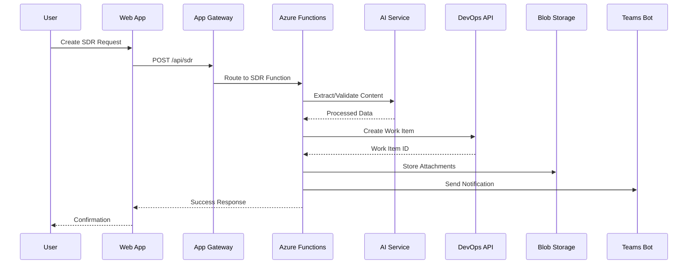
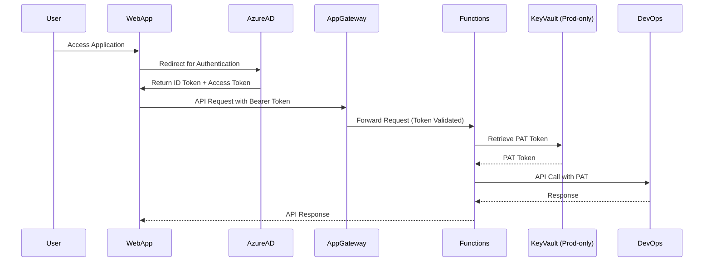

# SDR Management System - Technical Architecture Document
## System Design and Component Specifications

**Document Version:** 1.0  
**Date:** August 30, 2025  
**Author:** Solution Architect  
**Project:** SDR Management System Technical Architecture  

---

## 1. Executive Summary

This Technical Architecture Document (TAD) defines the comprehensive technical design for the SDR Management System, including system architecture, component interactions, data flows, and technical standards. This document serves as the authoritative reference for all technical implementation decisions.

### 1.1 Architecture Principles
- **Cloud-First**: Leverage Azure PaaS services for scalability and reliability
- **API-Driven**: RESTful APIs with OpenAPI specifications
- **Event-Driven**: Asynchronous processing for scalability
- **Security by Design**: Zero-trust security model
- **DevOps Native**: Infrastructure as Code and automated deployments

---

## 2. System Architecture Overview

### 2.1 High-Level Architecture Diagram

```
┌─────────────────────────────────────────────────────────────────────┐
│                        PRESENTATION LAYER                          │
├─────────────────┬─────────────────┬─────────────────┬───────────────┤
│   React SPA     │  Teams Bot UI   │  Mobile PWA     │  Email Client │
│  (Static Web    │  (Adaptive      │  (Service       │  (Logic Apps  │
│   Apps)         │   Cards)        │   Worker)       │   Triggered)  │
└─────────────────┴─────────────────┴─────────────────┴───────────────┘
                                    │
┌───────────────────────────────────┼───────────────────────────────────┐
│                    API GATEWAY LAYER                                 │
├─────────────────────────────────────────────────────────────────────┤
│           Azure Application Gateway + Web Application Firewall      │
│                    (Load Balancing, SSL, WAF)                       │
└─────────────────────────────────────────────────────────────────────┘
                                    │
┌───────────────────────────────────┼───────────────────────────────────┐
│                   APPLICATION LAYER                                  │
├─────────────────┬─────────────────┬─────────────────┬───────────────┤
│  Azure Functions│   Bot Service   │  Logic Apps     │  Event Grid   │
│  (API Endpoints)│  (Teams Bot)    │  (Workflows)    │  (Events)     │
│                 │                 │                 │               │
│  • SDR CRUD     │  • Conversation │  • Email Proc   │  • Pub/Sub    │
│  • File Upload  │  • Notifications│  • Notifications│  • Routing    │
│  • AI Processing│  • Quick Actions│  • Approvals    │  • Triggers   │
└─────────────────┴─────────────────┴─────────────────┴───────────────┘
                                    │
┌───────────────────────────────────┼───────────────────────────────────┐
│                   BUSINESS LAYER                                     │
├─────────────────┬─────────────────┬─────────────────┬───────────────┤
│  DevOps Service │  AI Service     │  Notification   │
│                 │                 │  Service        │  Service      │
│  • Work Items   │  • Content      │  • Teams        │
│  • Queries      │    Extraction   │  • Email        │
│  • Projects     │  • Validation   │  • Mobile       │
│  • Users        │  • Enhancement  │  • Webhooks     │
└─────────────────┴─────────────────┴─────────────────┴───────────────┘
                                    │
┌───────────────────────────────────┼───────────────────────────────────┐
│                     DATA LAYER                                       │
├─────────────────┬─────────────────┬─────────────────┬───────────────┤
│  Azure DevOps   │  Azure Blob     │  Azure Key      │  Application  │
│  (Work Items)   │  Storage        │  Vault          │  Insights     │
│                 │  (Files)        │  (Secrets)      │  (Telemetry)  │
│  • Projects     │  • Attachments  │  • PAT Tokens   │  • Logs       │
│  • Work Items   │  • Documents    │  • API Keys     │  • Metrics    │
│  • Comments     │  • Images       │  • Certificates │  • Traces     │
│  • History      │  • Exports      │  • Config       │  • Events     │
└─────────────────┴─────────────────┴─────────────────┴───────────────┘
```

### 2.2 Component Interaction Flow



---

## 3. Component Architecture Details

### 3.1 Frontend Architecture

#### 3.1.1 React Single Page Application
```typescript
// Architecture Pattern: Micro-Frontends with Feature-Based Structure
src/
├── app/                    // App shell and routing
│   ├── App.tsx
│   ├── store/             // Redux Toolkit store
│   └── router/            // React Router configuration
├── features/              // Feature-based modules
│   ├── auth/              // Authentication
│   │   ├── components/
│   │   ├── hooks/
│   │   ├── services/
│   │   └── types/
│   ├── sdr/               // SDR management
│   │   ├── components/
│   │   │   ├── SDRForm.tsx
│   │   │   ├── SDRDashboard.tsx
│   │   │   └── SDRDetails.tsx
│   │   ├── hooks/
│   │   │   ├── useSDRs.ts
│   │   │   └── useSDRMutations.ts
│   │   ├── services/
│   │   │   └── sdrApi.ts
│   │   └── types/
│   │       └── sdr.types.ts
│   ├── teams/             // Teams integration
├── shared/                // Shared utilities
│   ├── components/        // Reusable UI components
│   ├── hooks/             // Common hooks
│   ├── services/          // API clients
│   ├── types/             // Global types
│   └── utils/             // Utility functions
└── assets/                // Static assets
```

#### 3.1.2 State Management Architecture
```typescript
// Redux Toolkit with RTK Query
interface RootState {
  auth: {
    user: User | null;
    token: string | null;
    permissions: Permission[];
  };
  sdr: {
    currentSDR: SDR | null;
    filters: SDRFilters;
    pagination: PaginationState;
  };
  ui: {
    theme: 'light' | 'dark';
    sidebarOpen: boolean;
    notifications: Notification[];
  };
}

// API Slice Pattern
export const sdrApi = createApi({
  reducerPath: 'sdrApi',
  baseQuery: fetchBaseQuery({
    baseUrl: '/api/sdr',
    prepareHeaders: (headers, { getState }) => {
      const token = (getState() as RootState).auth.token;
      if (token) {
        headers.set('authorization', `Bearer ${token}`);
      }
      return headers;
    },
  }),
  tagTypes: ['SDR', 'User', 'Analytics'],
  endpoints: (builder) => ({
    getSDRs: builder.query<SDRListResponse, SDRFilters>({
      query: (filters) => ({ url: '', params: filters }),
      providesTags: ['SDR'],
    }),
    createSDR: builder.mutation<SDR, CreateSDRRequest>({
      query: (sdr) => ({ url: '', method: 'POST', body: sdr }),
      invalidatesTags: ['SDR'],
    }),
  }),
});
```

### 3.2 Backend Architecture

#### 3.2.1 Azure Functions Architecture
```
functions/
├── sdr-api/                   // Main SDR API Functions
│   ├── create-sdr/
│   │   ├── index.ts          // HTTP Trigger
│   │   ├── function.json     // Function configuration
│   │   └── README.md         // Function documentation
│   ├── get-sdrs/
│   ├── update-sdr/
│   ├── delete-sdr/
│   └── assign-developer/
├── ai-processing/             // AI and ML Functions
│   ├── process-email/
│   ├── extract-document/
│   ├── validate-extraction/
│   └── enhance-content/
├── notifications/             // Notification Functions
│   ├── send-teams-notification/
│   ├── send-email/
│   └── webhook-handler/
├── file-management/          // File Operations
│   ├── upload-file/
│   ├── process-upload/
│   └── generate-download-link/
└── shared/                   // Shared code
    ├── services/
    │   ├── devopsService.ts
    │   ├── aiService.ts
    │   ├── storageService.ts
    │   └── notificationService.ts
    ├── types/
    │   └── common.types.ts
    ├── utils/
    │   ├── validation.ts
    │   ├── auth.ts
    │   └── logging.ts
    └── config/
        └── environment.ts
```

#### 3.2.2 Function App Configuration
```json
{
  "version": "2.0",
  "extensionBundle": {
    "id": "Microsoft.Azure.Functions.ExtensionBundle",
    "version": "[4.*, 5.0.0)"
  },
  "functionTimeout": "00:05:00",
  "healthMonitor": {
    "enabled": true,
    "healthCheckInterval": "00:00:30",
    "healthCheckWindow": "00:02:00",
    "healthCheckThreshold": 6,
    "counterThreshold": 0.80
  },
  "logging": {
    "applicationInsights": {
      "samplingSettings": {
        "isEnabled": true,
        "excludedTypes": "Request"
      }
    },
    "logLevel": {
      "default": "Information",
      "Host.Results": "Error",
      "Function": "Information",
      "Host.Aggregator": "Trace"
    }
  }
}
```

### 3.3 Teams Bot Architecture

#### 3.3.1 Bot Framework Structure
```typescript
// Bot Architecture using Bot Framework SDK v4
export class SDRBot extends TeamsActivityHandler {
  private conversationState: ConversationState;
  private userState: UserState;
  private dialogSet: DialogSet;

  constructor(
    conversationState: ConversationState,
    userState: UserState,
    private sdrService: SDRService,
    private aiService: AIService
  ) {
    super();
    
    this.conversationState = conversationState;
    this.userState = userState;
    this.dialogSet = new DialogSet(conversationState.createProperty('DialogState'));
    
    // Add dialogs
    this.dialogSet.add(new SDRCreationDialog('sdrCreation', this.sdrService));
    this.dialogSet.add(new ApprovalDialog('approval', this.sdrService));
    
    this.setupMessageHandlers();
    this.setupTeamsHandlers();
  }

  private setupMessageHandlers(): void {
    this.onMessage(async (context, next) => {
      await this.handleUserMessage(context);
      await next();
    });
  }

  private async handleUserMessage(context: TurnContext): Promise<void> {
    const userMessage = context.activity.text?.toLowerCase() || '';
    
    if (userMessage.includes('create') && userMessage.includes('sdr')) {
      await this.beginDialog(context, 'sdrCreation');
    } else if (userMessage.includes('status')) {
      await this.handleStatusInquiry(context);
    } else {
      await this.handleNaturalLanguageInput(context);
    }
  }
}
```

#### 3.3.2 Adaptive Cards Templates
```typescript
// Card Templates with TypeScript typing
export interface AdaptiveCardTemplate {
  type: 'AdaptiveCard';
  version: string;
  body: CardElement[];
  actions?: CardAction[];
}

export const SDRCreationCard: AdaptiveCardTemplate = {
  type: 'AdaptiveCard',
  version: '1.4',
  body: [
    {
      type: 'TextBlock',
      text: 'Create New SDR',
      weight: 'Bolder',
      size: 'Medium',
      horizontalAlignment: 'Center'
    },
    {
      type: 'Container',
      items: [
        {
          type: 'Input.Text',
          id: 'title',
          label: 'Request Title',
          isRequired: true,
          errorMessage: 'Title is required'
        },
        {
          type: 'Input.Text',
          id: 'description',
          label: 'Description',
          isMultiline: true,
          maxLength: 1000
        },
        {
          type: 'Input.ChoiceSet',
          id: 'priority',
          label: 'Priority',
          choices: [
            { title: 'Low', value: 'Low' },
            { title: 'Medium', value: 'Medium' },
            { title: 'High', value: 'High' },
            { title: 'Critical', value: 'Critical' }
          ]
        }
      ]
    }
  ],
  actions: [
    {
      type: 'Action.Submit',
      title: 'Create SDR',
      style: 'positive',
      data: { action: 'submitSDR' }
    },
    {
      type: 'Action.Submit', 
      title: 'Cancel',
      data: { action: 'cancel' }
    }
  ]
};
```

---

## 4. Data Architecture

### 4.1 Azure DevOps Data Model

#### 4.1.1 Work Item Schema
```typescript
// DevOps Work Item Field Mapping
interface DevOpsSDRWorkItem {
  // System Fields
  'System.Id': number;
  'System.Title': string;
  'System.Description': string;
  'System.WorkItemType': 'SDR Request';
  'System.State': 'New' | 'Active' | 'Resolved' | 'Closed' | 'Removed';
  'System.AssignedTo': string;
  'System.CreatedBy': string;
  'System.CreatedDate': string;
  'System.ChangedBy': string;
  'System.ChangedDate': string;
  'System.AreaPath': string;
  'System.IterationPath': string;
  'System.Tags': string;
  
  // Custom SDR Fields
  'Custom.SubmitterId': string;           // Azure AD User ID
  'Custom.SubmitterEmail': string;
  'Custom.SubmitterName': string;
  'Custom.CustomerType': 'Internal' | 'External';
  'Custom.RequiredByDate': string;        // ISO date string
  'Custom.Priority': 'Low' | 'Medium' | 'High' | 'Critical';
  'Custom.EstimatedHours': number;
  'Custom.ActualHours': number;
  'Custom.SourceType': 'Manual' | 'Email' | 'File' | 'Teams';
  'Custom.OriginalSourcePath': string;    // Blob Storage URL
  'Custom.ApprovalStatus': 'Not Required' | 'Pending' | 'Approved' | 'Rejected';
  'Custom.ApprovalComments': string;
  'Custom.ApproverId': string;
  'Custom.ApprovalDate': string;
  'Custom.BusinessJustification': string;
  'Custom.TechnicalComplexity': 'Low' | 'Medium' | 'High';
  'Custom.RiskLevel': 'Low' | 'Medium' | 'High';
  'Custom.TestingRequired': boolean;
  'Custom.DocumentationRequired': boolean;
}
```

#### 4.1.2 DevOps Query Patterns
```typescript
// WIQL Queries for common operations
export const DevOpsQueries = {
  getUserSDRs: (userId: string) => `
    SELECT [System.Id], [System.Title], [System.State], [Custom.Priority], [Custom.RequiredByDate]
    FROM workitems 
    WHERE [System.WorkItemType] = 'SDR Request' 
    AND [Custom.SubmitterId] = '${userId}'
    ORDER BY [Custom.Priority] DESC, [Custom.RequiredByDate] ASC
  `,
  
  getPendingApprovals: () => `
    SELECT [System.Id], [System.Title], [Custom.EstimatedHours], [Custom.SubmitterName]
    FROM workitems 
    WHERE [System.WorkItemType] = 'SDR Request' 
    AND [Custom.ApprovalStatus] = 'Pending'
    ORDER BY [Custom.Priority] DESC
  `,
  
  getDeveloperWorkload: (developerId: string) => `
    SELECT [System.Id], [System.Title], [System.State], [Custom.EstimatedHours]
    FROM workitems 
    WHERE [System.WorkItemType] = 'SDR Request' 
    AND [System.AssignedTo] = '${developerId}'
    AND [System.State] IN ('New', 'Active')
  `,
  
  getMetricsData: (startDate: string, endDate: string) => `
    SELECT [System.Id], [System.State], [Custom.Priority], [Custom.EstimatedHours], [Custom.ActualHours], [System.CreatedDate], [System.ChangedDate]
    FROM workitems 
    WHERE [System.WorkItemType] = 'SDR Request' 
    AND [System.CreatedDate] >= '${startDate}'
    AND [System.CreatedDate] <= '${endDate}'
  `
};
```

### 4.2 File Storage Architecture

#### 4.2.1 Blob Storage Structure
```
Container: sdr-storage
├── attachments/                    // User uploaded files
│   ├── {sdr-id}/
│   │   ├── {file-id}.{extension}
│   │   └── metadata.json
├── ai-processing/                  // AI processing artifacts
│   ├── emails/
│   │   ├── {email-id}.json        // Processed email data
│   │   └── {email-id}.original    // Original email content
│   ├── documents/
│   │   ├── {doc-id}.json          // Extracted content
│   │   └── {doc-id}.original      // Original document
├── exports/                       // Generated reports and exports
│   ├── {export-id}.xlsx
│   └── {export-id}.pdf
├── templates/                     // Document templates
│   ├── sdr-templates/
│   └── report-templates/
└── system/                        // System files
    ├── configuration/
    └── backups/
```

#### 4.2.2 File Metadata Schema
```typescript
interface FileMetadata {
  id: string;
  sdrId: number;
  fileName: string;
  originalFileName: string;
  contentType: string;
  size: number;
  uploadedBy: string;
  uploadedAt: string;
  blobUrl: string;
  containerName: string;
  tags: string[];
  scanStatus: 'Pending' | 'Clean' | 'Infected' | 'Error';
  scanResults?: {
    scanDate: string;
    engine: string;
    threats?: string[];
  };
  retention: {
    category: 'Temporary' | 'Archive' | 'Permanent';
    deleteAfter?: string;
  };
}
```

---

## 5. Integration Architecture

### 5.1 DevOps API Integration

#### 5.1.1 Service Layer Pattern
```typescript
// DevOps Service with retry logic and error handling
export class DevOpsService {
  private readonly baseUrl: string;
  private readonly organization: string;
  private readonly patToken: string;
  private readonly httpClient: AxiosInstance;

  constructor(config: DevOpsConfig) {
    this.baseUrl = `https://dev.azure.com/${config.organization}`;
    this.organization = config.organization;
    this.patToken = config.patToken;
    
    this.httpClient = axios.create({
      baseURL: this.baseUrl,
      timeout: 30000,
      headers: {
        'Authorization': `Basic ${Buffer.from(`:${this.patToken}`).toString('base64')}`,
        'Content-Type': 'application/json-patch+json',
        'Accept': 'application/json'
      }
    });

    this.setupInterceptors();
  }

  private setupInterceptors(): void {
    // Request interceptor for logging
    this.httpClient.interceptors.request.use(
      (config) => {
        console.log(`DevOps API Request: ${config.method?.toUpperCase()} ${config.url}`);
        return config;
      },
      (error) => Promise.reject(error)
    );

    // Response interceptor with retry logic
    this.httpClient.interceptors.response.use(
      (response) => response,
      async (error) => {
        const config = error.config;
        
        if (error.response?.status === 429 && !config._retry) {
          config._retry = true;
          const retryAfter = error.response.headers['retry-after'] || 5;
          await new Promise(resolve => setTimeout(resolve, retryAfter * 1000));
          return this.httpClient.request(config);
        }
        
        return Promise.reject(error);
      }
    );
  }

  async createWorkItem(project: string, workItemData: CreateSDRRequest): Promise<DevOpsWorkItem> {
    const patchDocument = this.buildPatchDocument(workItemData);
    
    const response = await this.httpClient.post(
      `/${project}/_apis/wit/workitems/$SDR Request?api-version=7.0`,
      patchDocument
    );

    return response.data;
  }

  private buildPatchDocument(data: CreateSDRRequest): PatchOperation[] {
    return [
      { op: 'add', path: '/fields/System.Title', value: data.title },
      { op: 'add', path: '/fields/System.Description', value: data.description },
      { op: 'add', path: '/fields/Custom.SubmitterId', value: data.submitterId },
      { op: 'add', path: '/fields/Custom.CustomerType', value: data.customerType },
      { op: 'add', path: '/fields/Custom.Priority', value: data.priority },
      { op: 'add', path: '/fields/Custom.RequiredByDate', value: data.requiredByDate },
      { op: 'add', path: '/fields/Custom.SourceType', value: data.sourceType }
    ];
  }
}
```

### 5.2 AI Services Integration

#### 5.2.1 OpenAI Service Architecture
```typescript
// AI Service with content extraction and validation
export class AIService {
  private readonly openai: OpenAIApi;
  private readonly formRecognizer: FormRecognizerClient;
  
  constructor(config: AIServiceConfig) {
    this.openai = new OpenAIApi(new Configuration({
      apiKey: config.openaiApiKey,
      basePath: config.openaiEndpoint
    }));
    
    this.formRecognizer = new FormRecognizerClient(
      config.formRecognizerEndpoint,
      new AzureKeyCredential(config.formRecognizerKey)
    );
  }

  async extractSDRFromEmail(emailContent: string): Promise<ExtractedSDRData> {
    const systemPrompt = `
      You are an expert at extracting Small Development Request (SDR) information from emails.
      Extract the following information and return as JSON:
      - title: A concise title (max 100 chars)
      - description: Detailed description 
      - priority: Low, Medium, High, or Critical
      - customerType: Internal or External
      - requiredByDate: ISO date string if mentioned
      - businessJustification: Why this request is needed
      - technicalComplexity: Low, Medium, or High
      
      If information is not clearly stated, use "null" for that field.
      Ensure the JSON is valid and properly formatted.
    `;

    const response = await this.openai.createChatCompletion({
      model: 'gpt-4',
      messages: [
        { role: 'system', content: systemPrompt },
        { role: 'user', content: `Extract SDR information from: ${emailContent}` }
      ],
      temperature: 0.1,
      max_tokens: 1000
    });

    const extractedData = JSON.parse(response.data.choices[0].message?.content || '{}');
    
    return {
      ...extractedData,
      confidence: await this.calculateConfidence(extractedData, emailContent),
      extractionSource: 'email',
      processingTimestamp: new Date().toISOString()
    };
  }

  private async calculateConfidence(data: any, originalContent: string): Promise<number> {
    // Implementation of confidence scoring algorithm
    let score = 0;
    let maxScore = 0;

    // Title presence and quality
    maxScore += 25;
    if (data.title && data.title.length > 5 && data.title.length <= 100) {
      score += 25;
    } else if (data.title) {
      score += 10;
    }

    // Description presence and quality
    maxScore += 30;
    if (data.description && data.description.length > 20) {
      score += 30;
    } else if (data.description) {
      score += 15;
    }

    // Priority assessment
    maxScore += 15;
    if (data.priority && ['Low', 'Medium', 'High', 'Critical'].includes(data.priority)) {
      score += 15;
    }

    // Other fields
    maxScore += 30;
    if (data.customerType && ['Internal', 'External'].includes(data.customerType)) score += 10;
    if (data.requiredByDate && this.isValidDate(data.requiredByDate)) score += 10;
    if (data.businessJustification && data.businessJustification.length > 10) score += 10;

    return Math.round((score / maxScore) * 100) / 100;
  }
}
```

### 5.3 Teams Integration Architecture

#### 5.3.1 Bot Service Configuration
```json
{
  "botFramework": {
    "appId": "${BOT_APP_ID}",
    "appPassword": "${BOT_APP_PASSWORD}",
    "channelService": "https://smba.trafficmanager.net/amer/",
    "openIdMetadata": "https://login.botframework.com/v1/.well-known/openidconnection"
  },
  "teams": {
    "manifestVersion": "1.16",
    "capabilities": [
      "bot",
      "messagingExtension",
      "composeExtension"
    ],
    "scopes": [
      "personal",
      "team",
      "groupchat"
    ]
  },
  "messageExtensions": [
    {
      "botId": "${BOT_APP_ID}",
      "commands": [
        {
          "id": "searchSDRs",
          "type": "query",
          "title": "Search SDRs",
          "description": "Search for existing SDRs",
          "initialRun": true,
          "parameters": [
            {
              "name": "searchTerm",
              "title": "Search",
              "description": "Enter search term"
            }
          ]
        }
      ]
    }
  ]
}
```

---

## 6. Security Architecture

### 6.1 Authentication & Authorization Flow



### 6.2 Security Layers

#### 6.2.1 Network Security
```typescript
// Network Security Configuration
interface NetworkSecurityConfig {
  applicationGateway: {
    wafPolicy: {
      enabledRules: string[];
      customRules: WAFCustomRule[];
      exclusions: WAFExclusion[];
    };
    sslPolicy: {
      minProtocolVersion: 'TLSv1_2';
      cipherSuites: string[];
    };
  };
  
  virtualNetwork: {
    addressSpace: '10.0.0.0/16';
    subnets: {
      appGateway: '10.0.1.0/24';
      functions: '10.0.2.0/24';
      privateEndpoints: '10.0.3.0/24';
    };
    networkSecurityGroups: NSGRule[];
  };

  privateEndpoints: {
    keyVault: boolean; // Production environment only
    storage: boolean;
    devOps: boolean; // If available in region
  };
}
```

#### 6.2.2 Application Security
```typescript
// Security Middleware for Functions
export class SecurityMiddleware {
  static validateToken = async (context: Context, req: HttpRequest): Promise<void> => {
    const token = req.headers.authorization?.replace('Bearer ', '');
    
    if (!token) {
      throw new UnauthorizedError('Missing authorization token');
    }

    try {
      const decoded = jwt.verify(token, process.env.JWT_SECRET!) as JWTPayload;
      context.user = decoded;
      
      // Additional validation
      await this.validateUserPermissions(context, req);
      
    } catch (error) {
      throw new UnauthorizedError('Invalid token');
    }
  };

  static validateUserPermissions = async (context: Context, req: HttpRequest): Promise<void> => {
    const requiredRole = this.getRequiredRole(req.url, req.method);
    const userRoles = context.user.roles || [];

    if (requiredRole && !userRoles.includes(requiredRole)) {
      throw new ForbiddenError(`Required role: ${requiredRole}`);
    }
  };

  static sanitizeInput = (input: any): any => {
    // Implementation of input sanitization
    if (typeof input === 'string') {
      return input.replace(/<script\b[^<]*(?:(?!<\/script>)<[^<]*)*<\/script>/gi, '');
    }
    
    if (Array.isArray(input)) {
      return input.map(this.sanitizeInput);
    }
    
    if (typeof input === 'object' && input !== null) {
      const sanitized: any = {};
      for (const [key, value] of Object.entries(input)) {
        sanitized[key] = this.sanitizeInput(value);
      }
      return sanitized;
    }
    
    return input;
  };
}
```

---

## 7. Performance Architecture

### 7.1 Caching Strategy

```typescript
// Multi-layer caching strategy
export class CacheService {
  private redisClient: RedisClient;
  private memoryCache: Map<string, CacheEntry>;

  constructor() {
    this.redisClient = new RedisClient(process.env.REDIS_CONNECTION_STRING!);
    this.memoryCache = new Map();
  }

  async get<T>(key: string, ttl?: number): Promise<T | null> {
    // L1 Cache: Memory (fastest)
    const memoryEntry = this.memoryCache.get(key);
    if (memoryEntry && !this.isExpired(memoryEntry)) {
      return memoryEntry.value as T;
    }

    // L2 Cache: Redis (fast)
    const redisValue = await this.redisClient.get(key);
    if (redisValue) {
      const parsed = JSON.parse(redisValue) as T;
      this.setMemoryCache(key, parsed, ttl);
      return parsed;
    }

    return null;
  }

  async set<T>(key: string, value: T, ttl: number = 300): Promise<void> {
    // Set in both layers
    this.setMemoryCache(key, value, ttl);
    await this.redisClient.setex(key, ttl, JSON.stringify(value));
  }

  private setMemoryCache<T>(key: string, value: T, ttl?: number): void {
    const expiresAt = ttl ? Date.now() + (ttl * 1000) : undefined;
    this.memoryCache.set(key, { value, expiresAt });
  }
}

// Cache patterns for different data types
export const CachePatterns = {
  userProfile: (userId: string) => `user:${userId}`,
  userSDRs: (userId: string) => `sdrs:user:${userId}`,
  sdrDetails: (sdrId: number) => `sdr:${sdrId}`,
  devOpsQuery: (query: string) => `devops:${Buffer.from(query).toString('base64')}`,
};

export const CacheTTL = {
  userProfile: 3600,      // 1 hour
  userSDRs: 300,          // 5 minutes
  sdrDetails: 600,        // 10 minutes
  devOpsQuery: 180,       // 3 minutes
  staticData: 86400,      // 24 hours
};
```

### 7.2 Performance Optimization

```typescript
// Database query optimization
export class QueryOptimization {
  static optimizeDevOpsQuery(baseQuery: string, filters: any): string {
    let optimizedQuery = baseQuery;

    // Add indexes hint if available
    if (filters.assignedTo) {
      optimizedQuery += ` AND [System.AssignedTo] = '${filters.assignedTo}'`;
    }

    // Limit results for pagination
    if (filters.pageSize) {
      optimizedQuery += ` ORDER BY [System.ChangedDate] DESC LIMIT ${filters.pageSize}`;
    }

    return optimizedQuery;
  }

  static batchRequests<T>(requests: Promise<T>[], batchSize: number = 5): Promise<T[][]> {
    const batches: Promise<T[]>[] = [];
    
    for (let i = 0; i < requests.length; i += batchSize) {
      const batch = requests.slice(i, i + batchSize);
      batches.push(Promise.all(batch));
    }
    
    return Promise.all(batches);
  }
}

// Connection pooling and resource management
export class ResourceManager {
  private static connectionPool: Map<string, any> = new Map();
  
  static async getConnection(service: string): Promise<any> {
    if (!this.connectionPool.has(service)) {
      const connection = await this.createConnection(service);
      this.connectionPool.set(service, connection);
    }
    
    return this.connectionPool.get(service);
  }
  
  private static async createConnection(service: string): Promise<any> {
    switch (service) {
      case 'devops':
        return new DevOpsService(/* config */);
      case 'storage':
        return BlobServiceClient.fromConnectionString(process.env.STORAGE_CONNECTION_STRING!);
      default:
        throw new Error(`Unknown service: ${service}`);
    }
  }
}
```

---

## 8. Monitoring & Observability

### 8.1 Application Insights Configuration

```typescript
// Telemetry and monitoring setup
export class TelemetryService {
  private appInsights: TelemetryClient;

  constructor() {
    this.appInsights = new TelemetryClient(process.env.APPLICATIONINSIGHTS_CONNECTION_STRING!);
    this.setupCustomEvents();
  }

  private setupCustomEvents(): void {
    // Custom metrics for business events
    this.appInsights.trackEvent({
      name: 'SDR_Created',
      properties: {
        sourceType: 'manual',
        priority: 'medium',
        customerType: 'internal'
      },
      measurements: {
        processingTime: 1250
      }
    });
  }

  trackSDRCreation(sdr: SDR, processingTime: number): void {
    this.appInsights.trackEvent({
      name: 'SDR_Created',
      properties: {
        sdrId: sdr.id.toString(),
        sourceType: sdr.sourceType,
        priority: sdr.priority,
        customerType: sdr.customerType
      },
      measurements: {
        processingTime
      }
    });
  }

  trackPerformance(name: string, duration: number, success: boolean): void {
    this.appInsights.trackDependency({
      name,
      data: name,
      duration,
      success,
      dependencyTypeName: 'SDR_Operation'
    });
  }
}

// Health check endpoints
export const healthChecks = {
  overall: async (): Promise<HealthCheckResult> => {
    const checks = await Promise.allSettled([
      healthChecks.devops(),
      healthChecks.storage(),
      healthChecks.ai(),
      healthChecks.teams()
    ]);

    const failures = checks.filter(c => c.status === 'rejected').length;
    const status = failures === 0 ? 'healthy' : failures < checks.length ? 'degraded' : 'unhealthy';

    return {
      status,
      timestamp: new Date().toISOString(),
      checks: checks.map((c, i) => ({
        name: ['devops', 'storage', 'ai', 'teams'][i],
        status: c.status === 'fulfilled' ? 'healthy' : 'unhealthy'
      }))
    };
  },

  devops: async (): Promise<void> => {
    const devopsService = new DevOpsService(/* config */);
    await devopsService.testConnection();
  },

  storage: async (): Promise<void> => {
    const blobService = BlobServiceClient.fromConnectionString(process.env.STORAGE_CONNECTION_STRING!);
    await blobService.getAccountInfo();
  }
};
```

This Technical Architecture Document provides comprehensive technical guidance for implementing the SDR Management System with proper architectural patterns, security considerations, and performance optimizations.